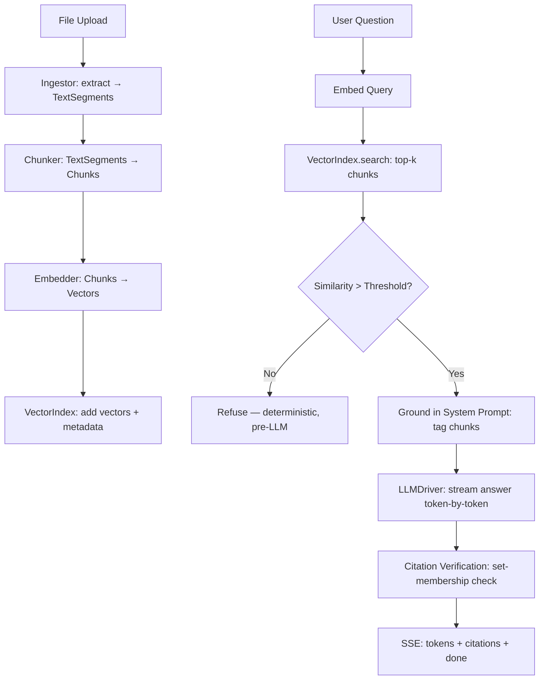

<p align="center">
  
</p>

<p align="center">
  <strong>A privacy-first, local-first document RAG assistant — your documents, your machine, your answers.</strong>
</p>

<p align="center">
  <a href="README.md">English</a> •
  <a href="docs/README.es.md">Spanish</a> •
  <a href="docs/README.zh.md">简体中文</a> •
  <a href="docs/README.ru.md">Русский</a> •
  <a href="docs/README.fr.md">Français</a>
</p>

<p align="center">
  <a href="https://github.com/pironc/keepr"></a>
  <a href="https://github.com/pironc/keepr"></a>
  <a href="https://github.com/pironc/keepr"></a>
</p>

# keepr

**keepr** is a retrieval-augmented generation (RAG) chat application that runs entirely on your own machine. Drop in PDFs or text files, ask questions, and get answers grounded in — and only in — what you uploaded, with inline citations back to the exact source passage. No cloud API, no data leaving your device, fully functional with the network switched off once the models are downloaded.

<p align="center">
  
</p>

## Why keepr?

Most RAG tools either send your documents to a cloud API (privacy risk) or wrap a black-box local server like Ollama (opaque internals). keepr takes the third path: **every layer is hand-rolled, documented, and owned by you** — from the vector index math to the LLM token streaming. The thesis is that a personal-scale RAG system doesn't need distributed infrastructure; it needs clear, correct code you can read and understand end-to-end.

- **Your data never leaves your machine.** No telemetry, no cloud API keys, no network calls during inference.
- **Every technology choice has a documented, specific reason** — not "because it's popular." See [ARCHITECTURE.md](ARCHITECTURE.md) for the full rationale behind each decision.
- **The anti-hallucination mechanism is deterministic** (a float comparison against a similarity threshold), not a prompt asking a 7-8B model to self-police.
- **Designed to scale** from a laptop to a dedicated server without a rewrite — every layer is behind a named interface with exactly one concrete implementation today, ready for a second when needed.

## Features

### 🔒 Privacy & Air-Gapped Operation
- **Fully local by default.** `LLM_DRIVER=mock` / `EMBEDDER=mock` (the defaults) run the entire ingestion → retrieval → citation pipeline with zero model downloads — testable in milliseconds.
- **Real local models** via `llama-cpp-python` (GGUF format) on Metal (Apple Silicon), CUDA, or CPU.
- **Air-gapped by design.** The frontend is hand-written vanilla HTML/CSS/JS with zero external dependencies — no CDN script tag, no npm build step. Fonts are vendored locally as `.woff2` files; icons are hand-authored inline SVGs.
- **Proven air-gapped.** The entire test suite runs with `pytest-socket` blocking all real network access, including a positive-control test proving the block is actually active.

### 📄 Chat-Grounded RAG with Deterministic Anti-Hallucination
- Every answer is backed by chunks retrieved from the documents *in that conversation* — not a global index, not the model's pre-training data.
- **Pre-LLM refusal:** If no retrieved chunk's cosine similarity clears the threshold, keepr refuses *before* the LLM is ever called — a deterministic `float` comparison, not a judgment call handed to the model.
- **Post-generation citation verification:** After the LLM streams its answer, every `[chunk_N]` citation tag is checked against the set of chunk IDs actually retrieved that turn. The model cannot fabricate a citation to a document that was never in front of it — this is enforced by set membership, not by trusting the model's output.
- **Individual per-chunk thresholding:** Every retrieved chunk is checked against the similarity bar individually, not just the best one — a single strong match can't drag several barely-related chunks into context.

### 🗂️ Per-Conversation Retrieval Scope
- Each conversation is its own retrieval scope, like a Claude Project or a NotebookLM notebook.
- The sidebar lets you switch between conversations, search by title, pin favorites, and rename or delete inline via a right-click context menu.
- Documents are de-duplicated by content hash (SHA-256) — re-attaching the same file is a no-op, not a silent duplication of every chunk.

### ⚡ Live Ingestion Pipeline
- A file is staged on drop and processed the moment you hit send: **extract → chunk → embed → index**.
- A per-file status animation (`staged → extracting → chunking → embedding → indexed`) is driven by real backend SSE events, not a fake timer.
- Every file type goes through the same pipeline — the `Ingestor` protocol is what makes audio/video support growable later without touching anything downstream.

### 🔄 Durable, Connection-Independent Generation
- The moment you hit send, message generation runs as a **background task** independent of your HTTP connection.
- Refresh the page mid-answer — the answer keeps generating and lands in the database regardless. Reloading reattaches to it live, wherever it's gotten to.
- Crash recovery: on startup, any message stuck mid-generation from a previous process death is marked as errored with its partial content preserved, rather than left spinning forever.

### 🧱 Pluggable Architecture
Every layer is behind a protocol/ABC — swap implementations without restructuring:

| Layer | Interface | Implementations |
|---|---|---|
| **LLM Driver** | `LLMDriver` | `MockLLMDriver` (deterministic, zero-download), `LlamaCppDriver` (real GGUF inference) |
| **Embedder** | `Embedder` | `MockEmbedder` (hashing-trick bag-of-words), `LlamaCppEmbedder` (nomic-embed-text-v2-moe, multilingual) |
| **Vector Index** | `VectorIndex` | `NumpyFlatIndex` (float32, exact), `QuantizedNumpyFlatIndex` (int8 scalar quant, ~4× less memory) |
| **Ingestor** | `Ingestor` | `PdfIngestor`, `TextIngestor`, `AudioVideoIngestor` (clean stub — raises `UnsupportedSourceError`) |
| **Storage** | `Repository` | SQLite via `aiosqlite` (the only module that speaks SQL — Postgres swap is a one-file change) |

### 🖥️ Native Desktop App
- A [Tauri](https://tauri.app/) v2 wrapper bundles the Python backend (compiled via PyInstaller) into a native macOS `.app` bundle and `.dmg` installer.
- Zero Python installation required on the target machine — the backend is a standalone binary embedded inside the app.
- The same codebase runs as a web app (`make run` for development with hot reload) or as a native desktop app (`make tauri-build` for distribution).

---

## Technology Stack & Rationale

Every choice in this stack was made for a specific, documented reason — not convention or popularity. See [ARCHITECTURE.md](ARCHITECTURE.md) for the full reasoning; here's the summary:

| Layer | Choice | Why this, not the alternative |
|---|---|---|
| **Language** | Python 3.12+ | Fast enough for a single-user app; the ML ecosystem (numpy, llama-cpp-python) is Python-native. |
| **API framework** | FastAPI + uvicorn | Async-native, SSE streaming built in, strong type system via Pydantic v2. |
| **LLM inference** | `llama-cpp-python` (GGUF) | Ollama is faster to a demo but opaque internally. `llama-cpp-python` gives real GGUF/K-quant/mmap internals from one codebase across Metal, CUDA, and CPU — you can read exactly how inference works. |
| **LLM model** | Qwen3-8B, Q6_K (~6.7 GB) | Swapped from Llama 3.1 8B for multilingual support — Qwen leads Chinese-language benchmarks by a wide margin and multilingual MMLU (~80 vs. ~72). Q6_K rather than a leaner quant because the memory budget has room. Newer MoE variants (Qwen3.5/3.6) were deliberately not chosen: on unified-memory machines (Apple Silicon), inactive MoE experts still occupy real RAM — an 8B dense model is the better fit for this hardware. |
| **Embedding model** | `nomic-embed-text-v2-moe` (GGUF, Q8_0) | Multilingual (~100 languages, 8-expert MoE), 768 dimensions. Same GGUF path, same `search_document:`/`search_query:` prefix convention as v1.5 — a drop-in swap from the English-only v1.5. |
| **Vector store** | Hand-rolled `NumpyFlatIndex` (float32, exact) | At a personal-scale corpus (thousands of chunks), brute-force cosine similarity is *not* a shortcut — it's the technically correct choice: exact (no ANN recall loss), sub-millisecond, and every line of the math is explainable. |
| **Vector quantization** | Hand-rolled int8 scalar quantization | Per-vector min/max scaling to int8 — ~4× memory reduction, 100% top-1 agreement with float32 on held-out queries. Implemented from scratch because the point is owning the technique, not configuring someone else's flag. |
| **PDF parsing** | `pypdf` | Pure Python, no heavy native dependencies, permissive license (avoids PyMuPDF's AGPL terms). |
| **Storage** | SQLite via `aiosqlite` | Correct for a single local user. The `Repository` class is the only module that speaks SQL — a Postgres swap is contained to one file. |
| **Frontend** | Vanilla HTML/CSS/JS, zero dependencies | Loading htmx or Alpine from a CDN would silently break the air-gapped claim on first page load. Vendoring adds a third-party dependency to track. ~250 lines of plain JS was the more honest trade. |
| **Desktop shell** | Tauri v2 (Rust) | Lightweight (~5 MB binary overhead vs. 100+ MB for Electron). The Python backend is compiled to a standalone binary via PyInstaller and bundled inside the `.app`. |
| **Package manager** | pip + hatchling | Standard Python tooling. Dependencies are minimal and pinned loosely (`.>=`), not locked — appropriate for an application, not a library. |
| **Linting & type checking** | ruff + mypy (`--strict`) | Fast, modern Python tooling. The entire codebase is strictly typed — `make typecheck` must pass. |
| **Testing** | pytest + pytest-asyncio + pytest-socket | `asyncio_mode = "auto"` so `async def test_...` just works. `--disable-socket` globally blocks network access in tests — a positive-control test proves the block is live. |

---

## System Architecture

The application isolates document processing into distinct, decoupled stages — each behind a named interface:



### 1. Ingestion Pipeline
Every file, regardless of type, goes through one uniform pipeline: **extract → chunk → embed → index**. Each `Ingestor` implementation reduces its source format to `TextSegment`s (text + a `PageRef` or `TimeRef`); chunking, embedding, indexing, and citation are 100% uniform downstream of that. This is the single design decision that makes audio/video growable later — implementing real transcription means filling in one `extract()` method, nothing else.

### 2. Anti-Hallucination is Deterministic
The system prompt (`src/rag/prompts.py`) does ask the model to refuse and cite sources — but that's the *second* line of defense. The first is a `float` comparison in `src/rag/engine.py`: if no retrieved chunk's cosine similarity clears `RETRIEVAL_MIN_SIMILARITY`, the engine returns the refusal text **without ever constructing a prompt or calling the LLM**. Citation verification is the same philosophy applied downstream: after generation, every `[chunk_N]` tag in the output is checked against the set of chunk IDs retrieved *for that specific turn*.

### 3. Per-Conversation Retrieval Scope
Documents are scoped to the conversation they were dropped into — not pooled into one global index. Each conversation gets its own `VectorIndex`, persisted to `data/index/{conversation_id}.npz` and cached in memory after first use. This avoids the "why did it cite something from an unrelated chat" confusion a single global index would produce.

---

## Data Structures

### Message Submission (`POST /api/conversations/{id}/messages`)
A multipart form with the user's question text and any newly staged files. The backend streams a single SSE response carrying both ingestion progress and the answer:

```
event: document_status
data: {"document_id":"d1","filename":"report.pdf","status":"extracting"}

event: document_status
data: {"document_id":"d1","filename":"report.pdf","status":"indexed"}

event: message_status
data: {"status":"retrieving"}

event: token
data: {"token":"The"}

event: token
data: {"token":" report"}

event: citations
data: {"citations":[{"chunk_id":"c3","document_id":"d1","document_filename":"report.pdf","source_ref":{"kind":"page","page":4},"snippet":"Revenue grew 12% YoY..."}]}

event: done
data: {}
```

### Reconnect Stream (`GET /api/conversations/{id}/messages/{message_id}/stream`)
The route a refreshed page calls to reattach to an in-progress (or already-finished) generation. Returns the same SSE event stream, replaying completed tokens and then going live.

### Core Models
Every shared shape lives in `src/models.py` as Pydantic v2 models — single source of truth for both the wire and the database:

```python
class SourceRef(PageRef | TimeRef):  # discriminated on `kind`
    """The detail that makes citations growable to audio/video later.
    Adding a real audio/video ingestor only ever produces a new TimeRef
    variant — it never requires touching Chunk, Citation, or anything
    downstream."""

class Chunk(BaseModel):
    id: str
    document_id: str
    conversation_id: str
    text: str
    source_ref: SourceRef
    chunk_index: int

class Citation(BaseModel):
    chunk_id: str
    document_id: str
    document_filename: str
    source_ref: SourceRef
    snippet: str

class Message(BaseModel):
    id: str
    conversation_id: str
    role: Literal["system", "user", "assistant"]
    content: str
    citations: list[Citation]
    status: MessageStatus  # queued → retrieving → generating → done | error
    created_at: datetime
```

---

## Getting Started

Full architecture and scaling guide: **[ARCHITECTURE.md](ARCHITECTURE.md)**.

### Docker

The fastest way to get a running instance — no Python setup needed:

**Prerequisites:** [Docker](https://docs.docker.com/get-docker/) with Compose v2.

```bash
git clone https://github.com/pironc/keepr.git
cd keepr
docker compose up --build
```

Open [http://localhost:8000](http://localhost:8000). Drop a PDF or `.txt` file into the chat and ask a question. The Compose file defaults to `LLM_DRIVER=mock` / `EMBEDDER=mock` — the entire pipeline runs with zero model downloads.

For real local inference, mount your models and switch the drivers:

```bash
# First, download GGUF models to data/models/ (one-time):
make download-models

# Then override the Compose environment:
LLM_DRIVER=llama_cpp EMBEDDER=llama_cpp docker compose up --build
```

### Local Development

Run natively with hot reload — no Docker needed:

**Prerequisites:** Python 3.12+.

```bash
git clone https://github.com/pironc/keepr.git
cd keepr

python3 -m venv .venv && source .venv/bin/activate
make install
make run
```

Open [http://localhost:8000](http://localhost:8000). The defaults (`LLM_DRIVER=mock`, `EMBEDDER=mock`) need zero downloads — the whole ingestion → retrieval → citation pipeline is testable immediately.

### Environment Variables

Copy `.env.example` to `.env` to customize. The essentials:

| Variable | Purpose |
|---|---|
| `LLM_DRIVER` | `mock` (default, zero-download) or `llama_cpp` (real local GGUF inference). |
| `LLM_MODEL_PATH` | Path to GGUF file. Only when `LLM_DRIVER=llama_cpp`. |
| `LLM_CONTEXT_WINDOW` | Context window size (default auto-detected from `MEMORY_TIER`, typically `8192`). |
| `LLM_GPU_LAYERS` | Layers to offload to GPU (`-1` = all, default). |
| `EMBEDDER` | `mock` (default) or `llama_cpp`. |
| `EMBEDDING_MODEL_PATH` | Path to GGUF embedding model. Only when `EMBEDDER=llama_cpp`. |
| `EMBEDDING_GPU_LAYERS` | Embedding GPU layers (default `0` — embedding runs on CPU to avoid GPU contention with the LLM). |
| `VECTOR_INDEX_BACKEND` | `flat` (float32, exact) or `quantized` (int8 scalar quant, ~4× less memory). |
| `RETRIEVAL_TOP_K` | Number of chunks to retrieve per query (default `5`). |
| `RETRIEVAL_MIN_SIMILARITY` | Cosine similarity threshold below which the engine refuses to answer (default `0.22` — calibrated against nomic-embed-text-v2-moe). |
| `DATABASE_PATH` | SQLite database path (default `data/keepr.db`). |
| `INDEX_DIR` | Per-conversation vector index directory (default `data/index`). |
| `UPLOAD_DIR` | Uploaded file storage (default `data/uploads`). |
| `MEMORY_TIER` | Override auto-detected memory budget (`minimal`, `standard`, `large`, `server`). Leave unset for auto-detection. |
| `CHUNK_SIZE` | Characters per chunk (default `800`). |
| `CHUNK_OVERLAP` | Overlap between consecutive chunks (default `150`). |
| `LOG_LEVEL` | Logging level (default `INFO`). |

### Running with Real Local Models

```bash
make download-models   # fetches Qwen3-8B + nomic-embed-text-v2-moe GGUF pair (~7.5 GB total)
```

Then in `.env`:

```env
LLM_DRIVER=llama_cpp
EMBEDDER=llama_cpp
```

Restart `make run`. The first message will be slower (model load into memory); everything after that runs from the resident warm stack.

### Native Desktop App (macOS)

```bash
# Development mode — opens a native window pointing at http://localhost:8000.
# The Python backend must already be running (`make run` in another terminal).
make tauri-dev

# Production build — compiles the Python backend to a standalone binary,
# bundles it into a .app, and produces a .dmg installer.
make tauri-build
```

The compiled `.app` requires no Python installation on the target machine — the backend is a self-contained PyInstaller binary embedded inside the bundle.

---

## Development

### Project Structure

```
keepr/
├── src/
│   ├── models.py              # Pydantic v2 models — single source of truth
│   ├── config.py              # Hardware detection, memory tiers, Settings
│   ├── concurrency.py         # LockedEmbedder / LockedLLMDriver wrappers
│   ├── logger.py              # Structured logging
│   ├── api/
│   │   ├── app.py             # FastAPI app factory + lifespan
│   │   ├── context.py         # AppContext + DI
│   │   ├── routes_conversations.py
│   │   ├── routes_messages.py # Multiplexed SSE endpoint
│   │   └── sse.py             # SSE formatting helpers
│   ├── db/
│   │   ├── pool.py            # SQLiteConnectionPool
│   │   ├── repository.py      # The ONLY module that speaks SQL
│   │   └── schema.py          # CREATE TABLE statements
│   ├── embeddings/
│   │   ├── base.py            # Embedder protocol
│   │   ├── mock_embedder.py   # Deterministic hashing-trick embedder
│   │   ├── llama_cpp_embedder.py  # Real GGUF embedding
│   │   └── factory.py
│   ├── ingestion/
│   │   ├── base.py            # Ingestor protocol
│   │   ├── pipeline.py        # Orchestrates extract→chunk→embed→index
│   │   ├── chunker.py         # Text chunking with overlap
│   │   ├── registry.py        # Finds the right ingestor for a file
│   │   ├── pdf_ingestor.py
│   │   ├── text_ingestor.py
│   │   └── audio_video_ingestor.py  # Clean stub — raises UnsupportedSourceError
│   ├── llm/
│   │   ├── base.py            # LLMDriver ABC (async token stream)
│   │   ├── mock_driver.py     # Deterministic mock for tests
│   │   ├── llama_cpp_driver.py    # Real GGUF inference with thinking-strip
│   │   └── factory.py
│   ├── rag/
│   │   ├── engine.py          # Core RAG: retrieval + threshold + generation + citation verify
│   │   ├── prompts.py         # Grounding system prompt
│   │   ├── generation_worker.py   # Background task — durable, connection-independent
│   │   ├── index_manager.py   # Per-conversation vector index cache
│   │   ├── greeting.py        # Fast-path greeting/farewell detection
│   │   └── title.py           # LLM-generated conversation titles
│   ├── vectorstore/
│   │   ├── base.py            # VectorIndex protocol
│   │   ├── flat_index.py      # NumpyFlatIndex (float32, exact)
│   │   ├── quantized_flat_index.py  # int8 scalar quantization
│   │   ├── similarity.py      # L2 normalization
│   │   └── factory.py
│   └── web/                   # Vanilla HTML/CSS/JS — zero external dependencies
│       ├── templates/index.html
│       └── static/
│           ├── app.js
│           ├── app.css
│           └── fonts/         # Vendored .woff2 files (no Google Fonts CDN)
├── src-tauri/                 # Tauri v2 native desktop wrapper (Rust)
│   ├── Cargo.toml
│   ├── tauri.conf.json
│   ├── src/lib.rs
│   └── binaries/              # PyInstaller-compiled backend binary
├── tests/                     # pytest + pytest-asyncio + pytest-socket
├── scripts/
│   └── download_models.py     # One-time GGUF model fetcher (the only network-touching script)
├── assets/                    # Logo, screenshots
├── ARCHITECTURE.md            # Full technical design & scaling story
├── CLAUDE.md                  # AI assistant / contributor guidance
├── Makefile
├── Dockerfile
├── docker-compose.yml
└── pyproject.toml
```

### Commands

```bash
make install          # pip install -e ".[dev]"
make run              # uvicorn src.api.app:app --reload --port 8000
make download-models  # fetch GGUF models (the only network-touching step)
make test             # pytest
make lint             # ruff check .
make typecheck        # mypy --strict
make ci               # lint + typecheck + test — run before considering anything done
make clean            # wipes DB/index/uploads (app state) — NOT model weights
make clean-models     # wipes data/models/ too
```

### Testing

```bash
make ci   # ruff check . && mypy && pytest
```

The test suite runs with network access disabled globally (`pytest-socket`) — any test that opens a real network socket fails the whole suite. Mock drivers and embedders make tests fast and deterministic (no model downloads, no flaky API calls). `asyncio_mode = "auto"` means `async def test_...` just works.

Key test files:
- `tests/test_rag_engine.py` — threshold-based refusal, citation verification (including a driver that deliberately fabricates a citation)
- `tests/test_generation_worker.py` — connection-independent generation, crash recovery, watcher reattachment
- `tests/test_ingestion_pipeline.py` — content-hash dedup, status transitions
- `tests/test_vectorstore.py` — quantization memory ratio & top-1 agreement benchmarks
- `tests/test_airgapped.py` — positive control proving the socket block is live
- `tests/test_llama_cpp_driver.py` — thinking-strip across split tags, no model needed

### Troubleshooting

**Answers seem unrelated to my documents**

The retrieval similarity might be below the threshold — check the server logs for the actual cosine similarity score and compare against `RETRIEVAL_MIN_SIMILARITY`. If you're using a different embedder than nomic-embed-text-v2-moe, recalibrate the threshold (see `ARCHITECTURE.md`).

**Mock driver gives generic responses**

The mock driver parses `[chunk_N]` tags from the system prompt for deterministic responses. If no chunks were retrieved (empty index), it will refuse. Add a document first.

**`make run` fails with an import error**

Run `make install` first — the package needs to be installed in editable mode.

---

## Scaling Past a Laptop

Every choice was picked for a single local user on one machine — but none of them are dead ends. Here's what changes if this moves to a dedicated machine:

| Concern | On a laptop (today) | On a dedicated machine | What changes |
|---|---|---|---|
| **Model size** | Qwen3-8B, Q6_K, 8k–16k context | 32B+/70B-class, 32k+ context | Env vars only — `config.py`'s tier ladder already has a `server` tier |
| **Vector search** | Hand-rolled flat NumPy, exact | ANN index (Qdrant, LanceDB) at 500K+ vectors | One more `VectorIndex` implementation — same interface |
| **Storage** | SQLite, one file, one user | Postgres, concurrent users | `repository.py` is the only module that speaks SQL |
| **Ingestion** | Inline per-request | Background job queue (Celery/arq) | Dispatch change — pipeline logic unchanged |
| **Audio/video** | Clean stub | Real transcription (faster-whisper) | Implement `extract()` — everything downstream is ready |

The throughline: every one of these is a **named interface with exactly one concrete implementation today**. Scaling up means adding a second implementation behind an interface that already exists, not restructuring the system around a new requirement.

---

## What's Deliberately Not Built Yet

Being explicit about scope:

- **Real audio/video transcription.** `AudioVideoIngestor.extract()` raises `UnsupportedSourceError` today. The plan: `faster-whisper`, lazy-loaded, memory-purged after use.
- **Conversation history truncation/summarization.** Long conversations currently send full history to the model every turn.
- **BM25/keyword search fused with vector search** (Reciprocal Rank Fusion) — cheap to add, catches exact-term queries embeddings miss.
- **File ingestion disconnect-resilience.** Ingestion runs inline in the request; a refresh mid-upload leaves a document stuck mid-status (though already-persisted chunks survive). The identical pattern `GenerationWorker` used for messages would generalize directly.
- **A labeled grounding eval set** (30-50 questions across answerable/unanswerable/adversarial categories, CI-enforced) — the mechanism is tested; a broader statistical harness is the natural next step.

---

## Design Principles

1. **Own your stack.** Every line of the retrieval/indexing/inference pipeline is in this repo — no black-box services, no "just configure this flag."
2. **Determinism over prompting for safety guarantees.** The headline "doesn't hallucinate" claim rests on a float comparison and a set-membership check, not on trusting a model's judgment.
3. **Interfaces before implementations.** Every layer boundary is a protocol/ABC. Adding a new backend means implementing an interface that already exists.
4. **Personal scale is not a shortcut — it's the correct design point.** Brute-force exact search, single-process concurrency, and SQLite are the right choices at this scale, not compromises.
5. **Air-gapped is proven, not claimed.** The test suite blocks all network access — any code path that opens a socket fails the entire suite.

---

## License

keepr is licensed under the [MIT License](LICENSE).

🤖 Generated with [Claude Code](https://claude.com/claude-code)
