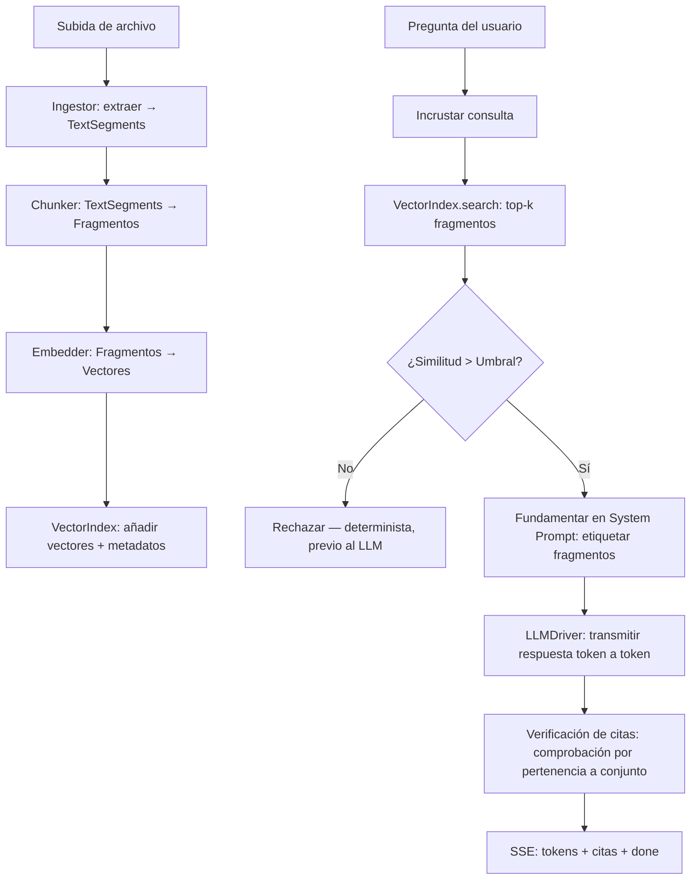

<p align="center">
  
</p>

<p align="center">
  <strong>Un asistente RAG de documentos local y centrado en la privacidad — tus documentos, tu máquina, tus respuestas.</strong>
</p>

<p align="center">
  <a href="../README.md">English</a> •
  <a href="README.es.md">Spanish</a> •
  <a href="README.zh.md">简体中文</a> •
  <a href="README.ru.md">Русский</a> •
  <a href="README.fr.md">Français</a>
</p>

<p align="center">
  <a href="https://github.com/pironc/keepr"></a>
  <a href="https://github.com/pironc/keepr"></a>
  <a href="https://github.com/pironc/keepr"></a>
</p>

# keepr

**keepr** es una aplicación de chat con generación aumentada por recuperación (RAG) que se ejecuta completamente en tu propia máquina. Sube archivos PDF o de texto, haz preguntas y obtén respuestas basadas exclusivamente —y solo— en lo que has subido, con citas en línea que apuntan al pasaje exacto de origen. Sin API en la nube, sin que tus datos salgan de tu dispositivo, completamente funcional con la red desconectada una vez descargados los modelos.

<p align="center">
  
</p>

## ¿Por qué keepr?

La mayoría de las herramientas RAG envían tus documentos a una API en la nube (riesgo de privacidad) o envuelven un servidor local opaco como Ollama (funcionamiento interno inaccesible). keepr toma un tercer camino: **cada capa está construida a mano, documentada y te pertenece** — desde las matemáticas del índice vectorial hasta la transmisión de tokens del LLM. La tesis es que un sistema RAG a escala personal no necesita infraestructura distribuida; necesita código claro y correcto que puedas leer y entender de principio a fin.

- **Tus datos nunca salen de tu máquina.** Sin telemetría, sin claves de API en la nube, sin llamadas de red durante la inferencia.
- **Cada decisión tecnológica tiene una razón documentada y específica** — no «porque es popular». Consulta [ARCHITECTURE.md](../ARCHITECTURE.md) para conocer el fundamento completo de cada decisión.
- **El mecanismo anti-alucinación es determinista** (una comparación de floats contra un umbral de similitud), no un prompt pidiéndole a un modelo de 7-8B que se autocontrole.
- **Diseñado para escalar** desde un portátil a un servidor dedicado sin reescribir nada — cada capa está detrás de una interfaz con nombre que hoy tiene exactamente una implementación concreta, lista para una segunda cuando se necesite.

## Funcionalidades

### 🔒 Privacidad y funcionamiento sin conexión
- **Completamente local por defecto.** `LLM_DRIVER=mock` / `EMBEDDER=mock` (los valores predeterminados) ejecutan todo el proceso de ingesta → recuperación → citas sin necesidad de descargar modelos — comprobable en milisegundos.
- **Modelos locales reales** mediante `llama-cpp-python` (formato GGUF) en Metal (Apple Silicon), CUDA o CPU.
- **Aislado de la red por diseño.** El frontend está escrito a mano en HTML/CSS/JS vanilla sin dependencias externas — sin etiquetas script de CDN, sin paso de compilación npm. Las fuentes tipográficas están almacenadas localmente como archivos `.woff2`; los iconos son SVGs en línea creados a mano.
- **Aislamiento de red comprobado.** Toda la suite de pruebas se ejecuta con `pytest-socket` bloqueando todo acceso real a la red, incluyendo una prueba de control positivo que demuestra que el bloqueo está realmente activo.

### 📄 Chat RAG con anti-alucinación determinista
- Cada respuesta está respaldada por fragmentos recuperados de los documentos *de esa conversación* — no de un índice global ni de los datos de preentrenamiento del modelo.
- **Rechazo previo al LLM:** si ningún fragmento recuperado supera el umbral de similitud coseno, keepr rechaza la consulta *antes* de llamar al LLM — una comparación determinista de `float`, no un juicio delegado al modelo.
- **Verificación de citas post-generación:** después de que el LLM transmite su respuesta, cada etiqueta de cita `[chunk_N]` se verifica contra el conjunto de IDs de fragmentos realmente recuperados en ese turno. El modelo no puede inventar una cita a un documento que nunca tuvo delante — esto se aplica por pertenencia a conjunto, no confiando en la salida del modelo.
- **Umbral individual por fragmento:** cada fragmento recuperado se compara contra el umbral de similitud individualmente, no solo el mejor — una única coincidencia fuerte no puede arrastrar varios fragmentos apenas relacionados al contexto.

### 🗂️ Alcance de recuperación por conversación
- Cada conversación tiene su propio alcance de recuperación, como un Proyecto de Claude o un cuaderno de NotebookLM.
- La barra lateral te permite alternar entre conversaciones, buscar por título, fijar favoritas y renombrar o eliminar directamente mediante un menú contextual con clic derecho.
- Los documentos se deduplican por hash de contenido (SHA-256) — volver a adjuntar el mismo archivo es una operación nula, no una duplicación silenciosa de cada fragmento.

### ⚡ Pipeline de ingesta en vivo
- Un archivo se prepara al soltarlo y se procesa en el momento en que pulsas enviar: **extraer → fragmentar → incrustar → indexar**.
- Una animación de estado por archivo (`staged → extracting → chunking → embedding → indexed`) se controla mediante eventos SSE reales del backend, no por un temporizador falso.
- Cada tipo de archivo pasa por el mismo pipeline — el protocolo `Ingestor` es lo que hace que el soporte de audio/vídeo sea ampliable más adelante sin tocar nada posterior en la cadena.

### 🔄 Generación duradera e independiente de la conexión
- En el momento en que pulsas enviar, la generación del mensaje se ejecuta como una **tarea en segundo plano** independiente de tu conexión HTTP.
- Recarga la página a mitad de una respuesta — la respuesta sigue generándose y se guarda en la base de datos de todos modos. Al recargar, te reconectas a ella en vivo, esté donde esté.
- Recuperación ante fallos: al iniciar, cualquier mensaje atascado a mitad de generación por una muerte anterior del proceso se marca como erróneo con su contenido parcial preservado, en lugar de quedarse girando para siempre.

### 🧱 Arquitectura conectable
Cada capa está detrás de un protocolo/ABC — intercambia implementaciones sin reestructurar:

| Capa | Interfaz | Implementaciones |
|---|---|---|
| **Driver LLM** | `LLMDriver` | `MockLLMDriver` (determinista, sin descarga), `LlamaCppDriver` (inferencia GGUF real) |
| **Incrustador** | `Embedder` | `MockEmbedder` (truco de hash tipo bolsa de palabras), `LlamaCppEmbedder` (nomic-embed-text-v2-moe, multilingüe) |
| **Índice vectorial** | `VectorIndex` | `NumpyFlatIndex` (float32, exacto), `QuantizedNumpyFlatIndex` (cuantización escalar int8, ~4× menos memoria) |
| **Ingestor** | `Ingestor` | `PdfIngestor`, `TextIngestor`, `AudioVideoIngestor` (stub limpio — lanza `UnsupportedSourceError`) |
| **Almacenamiento** | `Repository` | SQLite mediante `aiosqlite` (el único módulo que habla SQL — cambiar a Postgres es un cambio de un solo archivo) |

### 🖥️ Aplicación de escritorio nativa
- Un wrapper de [Tauri](https://tauri.app/) v2 empaqueta el backend Python (compilado con PyInstaller) en un bundle nativo `.app` de macOS y un instalador `.dmg`.
- No se requiere ninguna instalación de Python en la máquina de destino — el backend es un binario independiente incrustado dentro de la aplicación.
- El mismo código se ejecuta como aplicación web (`make run` para desarrollo con recarga en caliente) o como aplicación de escritorio nativa (`make tauri-build` para distribución).

---

## Stack tecnológico y fundamentos

Cada elección en este stack se hizo por una razón específica y documentada — no por convención o popularidad. Consulta [ARCHITECTURE.md](../ARCHITECTURE.md) para el razonamiento completo; aquí va el resumen:

| Capa | Elección | Por qué esto, y no la alternativa |
|---|---|---|
| **Lenguaje** | Python 3.12+ | Suficientemente rápido para una app de un solo usuario; el ecosistema ML (numpy, llama-cpp-python) es nativo de Python. |
| **Framework API** | FastAPI + uvicorn | Nativo en async, streaming SSE integrado, sistema de tipos sólido mediante Pydantic v2. |
| **Inferencia LLM** | `llama-cpp-python` (GGUF) | Ollama llega más rápido a una demo pero es opaco internamente. `llama-cpp-python` ofrece acceso real a los internos de GGUF/cuantización-K/mmap desde un solo código base en Metal, CUDA y CPU — puedes leer exactamente cómo funciona la inferencia. |
| **Modelo LLM** | Qwen3-8B, Q6_K (~6.7 GB) | Sustituyó a Llama 3.1 8B por su soporte multilingüe — Qwen lidera los benchmarks en chino por un margen amplio y en MMLU multilingüe (~80 vs. ~72). Q6_K en lugar de una cuantización más ligera porque el presupuesto de memoria lo permite. Las variantes MoE más recientes (Qwen3.5/3.6) se descartaron deliberadamente: en máquinas con memoria unificada (Apple Silicon), los expertos MoE inactivos siguen ocupando RAM real — un modelo denso de 8B se ajusta mejor a este hardware. |
| **Modelo de incrustación** | `nomic-embed-text-v2-moe` (GGUF, Q8_0) | Multilingüe (~100 idiomas, MoE de 8 expertos), 768 dimensiones. Misma ruta GGUF, misma convención de prefijos `search_document:`/`search_query:` que v1.5 — un reemplazo directo del modelo v1.5 solo en inglés. |
| **Almacén vectorial** | `NumpyFlatIndex` artesanal (float32, exacto) | A escala de corpus personal (miles de fragmentos), la similitud coseno por fuerza bruta *no* es un atajo — es la elección técnicamente correcta: exacta (sin pérdida de recall ANN), en menos de un milisegundo, y cada línea de las matemáticas es explicable. |
| **Cuantización vectorial** | Cuantización escalar int8 artesanal | Escalado min/max por vector a int8 — reducción de memoria de ~4×, 100% de concordancia en top-1 con float32 en consultas de prueba. Implementado desde cero porque el objetivo es dominar la técnica, no configurar la opción de otro. |
| **Parseo de PDF** | `pypdf` | Python puro, sin dependencias nativas pesadas, licencia permisiva (evita los términos AGPL de PyMuPDF). |
| **Almacenamiento** | SQLite mediante `aiosqlite` | Correcto para un solo usuario local. La clase `Repository` es el único módulo que habla SQL — cambiar a Postgres está contenido en un solo archivo. |
| **Frontend** | HTML/CSS/JS vanilla, cero dependencias | Cargar htmx o Alpine desde un CDN rompería silenciosamente la afirmación de funcionamiento sin conexión en la primera carga de página. Incluirlos como dependencia local añade una dependencia de terceros que rastrear. ~250 líneas de JS plano fue la decisión más honesta. |
| **Shell de escritorio** | Tauri v2 (Rust) | Ligero (~5 MB de sobrecarga binaria frente a 100+ MB de Electron). El backend Python se compila a un binario independiente mediante PyInstaller y se empaqueta dentro del `.app`. |
| **Gestor de paquetes** | pip + hatchling | Herramientas estándar de Python. Las dependencias son mínimas y con versiones flexibles (`.>=`), no bloqueadas — apropiado para una aplicación, no una biblioteca. |
| **Linting y verificación de tipos** | ruff + mypy (`--strict`) | Herramientas Python modernas y rápidas. Todo el código está estrictamente tipado — `make typecheck` debe pasar. |
| **Pruebas** | pytest + pytest-asyncio + pytest-socket | `asyncio_mode = "auto"` para que `async def test_...` simplemente funcione. `--disable-socket` bloquea globalmente el acceso a la red en las pruebas — una prueba de control positivo demuestra que el bloqueo está activo. |

---

## Arquitectura del sistema

La aplicación aísla el procesamiento de documentos en etapas distintas y desacopladas — cada una detrás de una interfaz con nombre:



### 1. Pipeline de ingesta
Cada archivo, independientemente de su tipo, pasa por un pipeline uniforme: **extraer → fragmentar → incrustar → indexar**. Cada implementación de `Ingestor` reduce su formato de origen a `TextSegment`s (texto + un `PageRef` o `TimeRef`); la fragmentación, incrustación, indexación y citas son 100% uniformes a partir de ese punto. Esta es la única decisión de diseño que hace que el soporte de audio/vídeo sea ampliable más adelante — implementar la transcripción real significa completar un solo método `extract()`, nada más.

### 2. La anti-alucinación es determinista
El system prompt (`src/rag/prompts.py`) le pide al modelo que rechace consultas y cite fuentes — pero esa es la *segunda* línea de defensa. La primera es una comparación de `float` en `src/rag/engine.py`: si ningún fragmento recuperado supera el umbral de similitud coseno definido en `RETRIEVAL_MIN_SIMILARITY`, el motor devuelve el texto de rechazo **sin llegar a construir un prompt ni llamar al LLM**. La verificación de citas aplica la misma filosofía aguas abajo: después de la generación, cada etiqueta `[chunk_N]` en la salida se comprueba contra el conjunto de IDs de fragmentos recuperados *para ese turno específico*.

### 3. Alcance de recuperación por conversación
Los documentos se limitan a la conversación en la que se soltaron — no se agrupan en un índice global. Cada conversación tiene su propio `VectorIndex`, persistido en `data/index/{conversation_id}.npz` y almacenado en caché en memoria tras el primer uso. Esto evita la confusión de «¿por qué citó algo de un chat no relacionado?» que produciría un único índice global.

---

## Estructuras de datos

### Envío de mensaje (`POST /api/conversations/{id}/messages`)
Un formulario multipart con el texto de la pregunta del usuario y cualquier archivo nuevo preparado. El backend transmite una única respuesta SSE que lleva tanto el progreso de ingesta como la respuesta:

```
event: document_status
data: {"document_id":"d1","filename":"report.pdf","status":"extracting"}

event: document_status
data: {"document_id":"d1","filename":"report.pdf","status":"indexed"}

event: message_status
data: {"status":"retrieving"}

event: token
data: {"token":"El"}

event: token
data: {"token":" informe"}

event: citations
data: {"citations":[{"chunk_id":"c3","document_id":"d1","document_filename":"report.pdf","source_ref":{"kind":"page","page":4},"snippet":"Los ingresos crecieron un 12% interanual..."}]}

event: done
data: {}
```

### Stream de reconexión (`GET /api/conversations/{id}/messages/{message_id}/stream`)
La ruta que una página recargada llama para reconectarse a una generación en curso (o ya finalizada). Devuelve el mismo stream de eventos SSE, reproduciendo los tokens ya completados y luego continuando en vivo.

### Modelos principales
Cada forma de datos compartida vive en `src/models.py` como modelos Pydantic v2 — fuente única de verdad tanto para la comunicación como para la base de datos:

```python
class SourceRef(PageRef | TimeRef):  # discriminado por `kind`
    """El detalle que hace que las citas sean ampliables a audio/vídeo más adelante.
    Añadir un ingestor real de audio/vídeo solo produce una nueva variante TimeRef
    — nunca requiere modificar Chunk, Citation ni nada
    posterior en la cadena."""

class Chunk(BaseModel):
    id: str
    document_id: str
    conversation_id: str
    text: str
    source_ref: SourceRef
    chunk_index: int

class Citation(BaseModel):
    chunk_id: str
    document_id: str
    document_filename: str
    source_ref: SourceRef
    snippet: str

class Message(BaseModel):
    id: str
    conversation_id: str
    role: Literal["system", "user", "assistant"]
    content: str
    citations: list[Citation]
    status: MessageStatus  # queued → retrieving → generating → done | error
    created_at: datetime
```

---

## Primeros pasos

Guía completa de arquitectura y escalado: **[ARCHITECTURE.md](../ARCHITECTURE.md)**.

### Docker

La forma más rápida de tener una instancia en funcionamiento — sin necesidad de configurar Python:

**Requisitos previos:** [Docker](https://docs.docker.com/get-docker/) con Compose v2.

```bash
git clone https://github.com/pironc/keepr.git
cd keepr
docker compose up --build
```

Abre [http://localhost:8000](http://localhost:8000). Suelta un PDF o un archivo `.txt` en el chat y haz una pregunta. El archivo Compose usa por defecto `LLM_DRIVER=mock` / `EMBEDDER=mock` — todo el pipeline se ejecuta sin necesidad de descargar modelos.

Para inferencia local real, monta tus modelos y cambia los drivers:

```bash
# Primero, descarga los modelos GGUF en data/models/ (solo una vez):
make download-models

# Luego sobrescribe las variables de entorno de Compose:
LLM_DRIVER=llama_cpp EMBEDDER=llama_cpp docker compose up --build
```

### Desarrollo local

Ejecuta de forma nativa con recarga en caliente — sin necesidad de Docker:

**Requisitos previos:** Python 3.12+.

```bash
git clone https://github.com/pironc/keepr.git
cd keepr

python3 -m venv .venv && source .venv/bin/activate
make install
make run
```

Abre [http://localhost:8000](http://localhost:8000). Los valores predeterminados (`LLM_DRIVER=mock`, `EMBEDDER=mock`) no requieren ninguna descarga — todo el pipeline de ingesta → recuperación → citas se puede probar de inmediato.

### Variables de entorno

Copia `.env.example` a `.env` para personalizarlas. Las esenciales:

| Variable | Propósito |
|---|---|
| `LLM_DRIVER` | `mock` (por defecto, sin descarga) o `llama_cpp` (inferencia GGUF local real). |
| `LLM_MODEL_PATH` | Ruta al archivo GGUF. Solo cuando `LLM_DRIVER=llama_cpp`. |
| `LLM_CONTEXT_WINDOW` | Tamaño de la ventana de contexto (por defecto se detecta automáticamente desde `MEMORY_TIER`, típicamente `8192`). |
| `LLM_GPU_LAYERS` | Capas a descargar en la GPU (`-1` = todas, por defecto). |
| `EMBEDDER` | `mock` (por defecto) o `llama_cpp`. |
| `EMBEDDING_MODEL_PATH` | Ruta al modelo GGUF de incrustación. Solo cuando `EMBEDDER=llama_cpp`. |
| `EMBEDDING_GPU_LAYERS` | Capas de GPU para incrustación (por defecto `0` — la incrustación se ejecuta en CPU para evitar contención de GPU con el LLM). |
| `VECTOR_INDEX_BACKEND` | `flat` (float32, exacto) o `quantized` (cuantización escalar int8, ~4× menos memoria). |
| `RETRIEVAL_TOP_K` | Número de fragmentos a recuperar por consulta (por defecto `5`). |
| `RETRIEVAL_MIN_SIMILARITY` | Umbral de similitud coseno por debajo del cual el motor se niega a responder (por defecto `0.22` — calibrado para nomic-embed-text-v2-moe). |
| `DATABASE_PATH` | Ruta de la base de datos SQLite (por defecto `data/keepr.db`). |
| `INDEX_DIR` | Directorio de índices vectoriales por conversación (por defecto `data/index`). |
| `UPLOAD_DIR` | Almacenamiento de archivos subidos (por defecto `data/uploads`). |
| `MEMORY_TIER` | Sobrescribe el presupuesto de memoria auto-detectado (`minimal`, `standard`, `large`, `server`). Déjalo sin configurar para detección automática. |
| `CHUNK_SIZE` | Caracteres por fragmento (por defecto `800`). |
| `CHUNK_OVERLAP` | Solapamiento entre fragmentos consecutivos (por defecto `150`). |
| `LOG_LEVEL` | Nivel de registro (por defecto `INFO`). |

### Ejecución con modelos locales reales

```bash
make download-models   # descarga el par Qwen3-8B + nomic-embed-text-v2-moe GGUF (~7.5 GB en total)
```

Luego en `.env`:

```env
LLM_DRIVER=llama_cpp
EMBEDDER=llama_cpp
```

Reinicia `make run`. El primer mensaje será más lento (carga del modelo en memoria); todo lo posterior se ejecuta desde el stack residente ya caliente.

### Aplicación de escritorio nativa (macOS)

```bash
# Modo desarrollo — abre una ventana nativa apuntando a http://localhost:8000.
# El backend Python ya debe estar en ejecución (`make run` en otra terminal).
make tauri-dev

# Compilación de producción — compila el backend Python a un binario independiente,
# lo empaqueta en un .app y genera un instalador .dmg.
make tauri-build
```

El `.app` compilado no requiere instalación de Python en la máquina de destino — el backend es un binario PyInstaller autónomo incrustado dentro del bundle.

---

## Desarrollo

### Estructura del proyecto

```
keepr/
├── src/
│   ├── models.py              # Modelos Pydantic v2 — fuente única de verdad
│   ├── config.py              # Detección de hardware, niveles de memoria, Settings
│   ├── concurrency.py         # Wrappers LockedEmbedder / LockedLLMDriver
│   ├── logger.py              # Registro estructurado
│   ├── api/
│   │   ├── app.py             # Fábrica de la app FastAPI + lifespan
│   │   ├── context.py         # AppContext + DI
│   │   ├── routes_conversations.py
│   │   ├── routes_messages.py # Endpoint SSE multiplexado
│   │   └── sse.py             # Helpers de formato SSE
│   ├── db/
│   │   ├── pool.py            # SQLiteConnectionPool
│   │   ├── repository.py      # El ÚNICO módulo que habla SQL
│   │   └── schema.py          # Sentencias CREATE TABLE
│   ├── embeddings/
│   │   ├── base.py            # Protocolo Embedder
│   │   ├── mock_embedder.py   # Incrustador determinista por truco de hash
│   │   ├── llama_cpp_embedder.py  # Incrustación GGUF real
│   │   └── factory.py
│   ├── ingestion/
│   │   ├── base.py            # Protocolo Ingestor
│   │   ├── pipeline.py        # Orquesta extraer→fragmentar→incrustar→indexar
│   │   ├── chunker.py         # Fragmentación de texto con solapamiento
│   │   ├── registry.py        # Encuentra el ingestor adecuado para un archivo
│   │   ├── pdf_ingestor.py
│   │   ├── text_ingestor.py
│   │   └── audio_video_ingestor.py  # Stub limpio — lanza UnsupportedSourceError
│   ├── llm/
│   │   ├── base.py            # LLMDriver ABC (stream asíncrono de tokens)
│   │   ├── mock_driver.py     # Mock determinista para pruebas
│   │   ├── llama_cpp_driver.py    # Inferencia GGUF real con filtro de thinking
│   │   └── factory.py
│   ├── rag/
│   │   ├── engine.py          # RAG principal: recuperación + umbral + generación + verificación de citas
│   │   ├── prompts.py         # System prompt de fundamentación
│   │   ├── generation_worker.py   # Tarea en segundo plano — duradera, independiente de la conexión
│   │   ├── index_manager.py   # Caché de índices vectoriales por conversación
│   │   ├── greeting.py        # Detección rápida de saludo/despedida
│   │   └── title.py           # Títulos de conversación generados por LLM
│   ├── vectorstore/
│   │   ├── base.py            # Protocolo VectorIndex
│   │   ├── flat_index.py      # NumpyFlatIndex (float32, exacto)
│   │   ├── quantized_flat_index.py  # Cuantización escalar int8
│   │   ├── similarity.py      # Normalización L2
│   │   └── factory.py
│   └── web/                   # HTML/CSS/JS vanilla — cero dependencias externas
│       ├── templates/index.html
│       └── static/
│           ├── app.js
│           ├── app.css
│           └── fonts/         # Archivos .woff2 locales (sin CDN de Google Fonts)
├── src-tauri/                 # Wrapper de escritorio nativo Tauri v2 (Rust)
│   ├── Cargo.toml
│   ├── tauri.conf.json
│   ├── src/lib.rs
│   └── binaries/              # Binario del backend compilado con PyInstaller
├── tests/                     # pytest + pytest-asyncio + pytest-socket
├── scripts/
│   └── download_models.py     # Descargador único de modelos GGUF (el único script que toca la red)
├── assets/                    # Logo, capturas de pantalla
├── ARCHITECTURE.md            # Diseño técnico completo e historia de escalado
├── CLAUDE.md                  # Guía para asistentes AI / contribuidores
├── Makefile
├── Dockerfile
├── docker-compose.yml
└── pyproject.toml
```

### Comandos

```bash
make install          # pip install -e ".[dev]"
make run              # uvicorn src.api.app:app --reload --port 8000
make download-models  # descargar modelos GGUF (el único paso que toca la red)
make test             # pytest
make lint             # ruff check .
make typecheck        # mypy --strict
make ci               # lint + typecheck + test — ejecutar antes de dar nada por terminado
make clean            # borra DB/índice/subidas (estado de la app) — NO los pesos de los modelos
make clean-models     # borra también data/models/
```

### Pruebas

```bash
make ci   # ruff check . && mypy && pytest
```

La suite de pruebas se ejecuta con el acceso a la red deshabilitado globalmente (`pytest-socket`) — cualquier prueba que abra un socket de red real hace fallar toda la suite. Los drivers e incrustadores mock hacen que las pruebas sean rápidas y deterministas (sin descargas de modelos, sin llamadas API inestables). `asyncio_mode = "auto"` significa que `async def test_...` simplemente funciona.

Archivos de prueba clave:
- `tests/test_rag_engine.py` — rechazo por umbral, verificación de citas (incluyendo un driver que deliberadamente inventa una cita)
- `tests/test_generation_worker.py` — generación independiente de la conexión, recuperación ante fallos, reconexión del observador
- `tests/test_ingestion_pipeline.py` — deduplicación por hash de contenido, transiciones de estado
- `tests/test_vectorstore.py` — benchmarks de ratio de memoria de cuantización y concordancia top-1
- `tests/test_airgapped.py` — control positivo que demuestra que el bloqueo de sockets está activo
- `tests/test_llama_cpp_driver.py` — filtro de thinking a través de etiquetas divididas, sin necesidad de modelo

### Solución de problemas

**Las respuestas parecen no estar relacionadas con mis documentos**

La similitud de recuperación podría estar por debajo del umbral — revisa los registros del servidor para ver la puntuación real de similitud coseno y compárala con `RETRIEVAL_MIN_SIMILARITY`. Si estás usando un incrustador diferente a nomic-embed-text-v2-moe, recalibra el umbral (consulta `ARCHITECTURE.md`).

**El driver mock da respuestas genéricas**

El driver mock analiza las etiquetas `[chunk_N]` del system prompt para obtener respuestas deterministas. Si no se recuperaron fragmentos (índice vacío), rechazará la consulta. Añade un documento primero.

**`make run` falla con un error de importación**

Ejecuta `make install` primero — el paquete necesita instalarse en modo editable.

---

## Escalar más allá de un portátil

Cada elección se hizo pensando en un único usuario local en una máquina — pero ninguna es un callejón sin salida. Esto es lo que cambia si el sistema se traslada a una máquina dedicada:

| Aspecto | En un portátil (hoy) | En una máquina dedicada | Qué cambia |
|---|---|---|---|
| **Tamaño del modelo** | Qwen3-8B, Q6_K, contexto 8k–16k | Clase 32B+/70B, contexto 32k+ | Solo variables de entorno — la escalera de niveles de `config.py` ya tiene un nivel `server` |
| **Búsqueda vectorial** | NumPy plano artesanal, exacto | Índice ANN (Qdrant, LanceDB) a partir de 500K+ vectores | Una implementación más de `VectorIndex` — misma interfaz |
| **Almacenamiento** | SQLite, un archivo, un usuario | Postgres, usuarios concurrentes | `repository.py` es el único módulo que habla SQL |
| **Ingesta** | En línea, por petición | Cola de trabajos en segundo plano (Celery/arq) | Cambio de despacho — la lógica del pipeline no cambia |
| **Audio/vídeo** | Stub limpio | Transcripción real (faster-whisper) | Implementar `extract()` — todo lo posterior está listo |

El hilo conductor: cada uno de estos es una **interfaz con nombre que hoy tiene exactamente una implementación concreta**. Escalar significa añadir una segunda implementación detrás de una interfaz que ya existe, no reestructurar el sistema en torno a un nuevo requisito.

---

## Lo que deliberadamente no se ha construido aún

Siendo explícitos sobre el alcance:

- **Transcripción real de audio/vídeo.** `AudioVideoIngestor.extract()` lanza `UnsupportedSourceError` hoy. El plan: `faster-whisper`, carga diferida, memoria liberada tras su uso.
- **Truncamiento/resumen del historial de conversación.** Las conversaciones largas actualmente envían el historial completo al modelo en cada turno.
- **Búsqueda BM25/palabras clave fusionada con búsqueda vectorial** (Reciprocal Rank Fusion) — barato de añadir, captura consultas de términos exactos que las incrustaciones pasan por alto.
- **Resiliencia ante desconexión en la ingesta de archivos.** La ingesta se ejecuta en línea dentro de la petición; una recarga a mitad de la subida deja un documento atascado en un estado intermedio (aunque los fragmentos ya persistidos sobreviven). El patrón idéntico que `GenerationWorker` usó para los mensajes se generalizaría directamente.
- **Un conjunto de evaluación de fundamentación etiquetado** (30-50 preguntas en categorías respondibles/no respondibles/adversariales, aplicado en CI) — el mecanismo está probado; un sistema estadístico más amplio es el siguiente paso natural.

---

## Principios de diseño

1. **Domina tu stack.** Cada línea del pipeline de recuperación/indexación/inferencia está en este repositorio — sin servicios de caja negra, sin «solo configura esta opción».
2. **Determinismo sobre prompting para garantías de seguridad.** La afirmación principal de «no alucina» descansa en una comparación de floats y una comprobación de pertenencia a conjunto, no en confiar en el juicio de un modelo.
3. **Interfaces antes que implementaciones.** Cada límite de capa es un protocolo/ABC. Añadir un nuevo backend significa implementar una interfaz que ya existe.
4. **La escala personal no es un atajo — es el punto de diseño correcto.** La búsqueda exacta por fuerza bruta, la concurrencia de un solo proceso y SQLite son las elecciones correctas a esta escala, no compromisos.
5. **El funcionamiento sin conexión está demostrado, no afirmado.** La suite de pruebas bloquea todo acceso a la red — cualquier ruta de código que abra un socket hace fallar toda la suite.

---

## Licencia

keepr está bajo la [Licencia MIT](../LICENSE).

🤖 Generado con [Claude Code](https://claude.com/claude-code)
