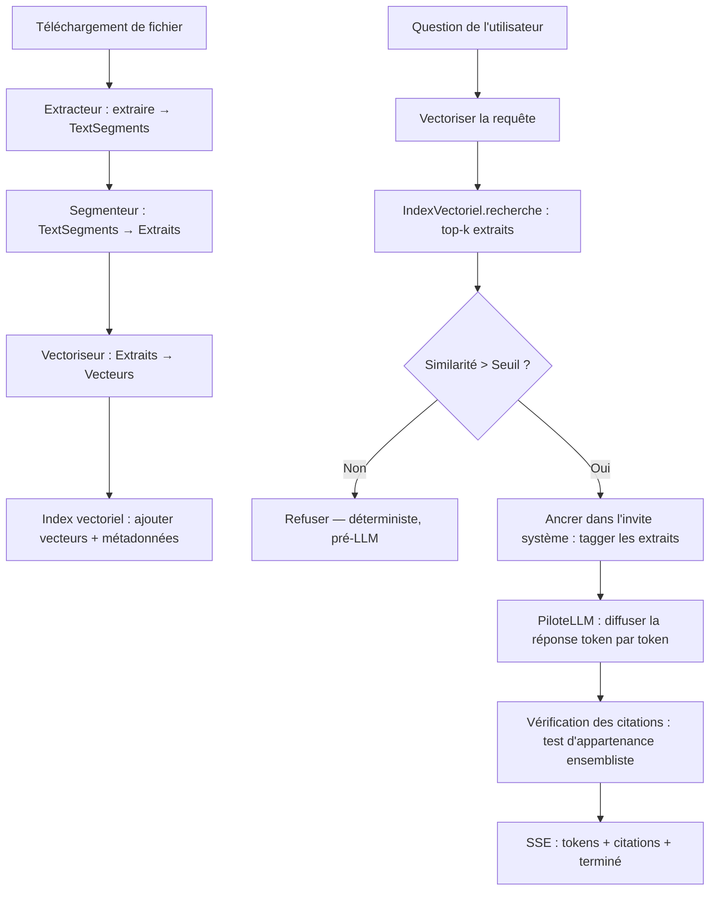

<p align="center">
  
</p>

<p align="center">
  <strong>Un assistant RAG documentaire respectueux de la vie privée et local-first — vos documents, votre machine, vos réponses.</strong>
</p>

<p align="center">
  <a href="../README.md">English</a> •
  <a href="README.es.md">Spanish</a> •
  <a href="README.zh.md">简体中文</a> •
  <a href="README.ru.md">Русский</a> •
  <a href="README.fr.md">Français</a>
</p>

<p align="center">
  <a href="https://github.com/pironc/keepr"></a>
  <a href="https://github.com/pironc/keepr"></a>
  <a href="https://github.com/pironc/keepr"></a>
  <a href="https://github.com/pironc/keepr"></a>
</p>

<p align="center">
  <a href="https://github.com/pironc/keepr/releases/latest/download/keepr-mac-aarch64.dmg"></a>
  <a href="https://github.com/pironc/keepr/releases/latest/download/keepr-mac-x86_64.dmg"></a>
  <a href="https://github.com/pironc/keepr/releases/latest/download/keepr-linux-x86_64.AppImage"></a>
  <a href="https://github.com/pironc/keepr/releases/latest/download/keepr-windows-x86_64-setup.exe"></a>
</p>

# keepr

**keepr** est une application de chat par génération augmentée de récupération (RAG) qui s'exécute entièrement sur votre propre machine. Déposez des PDF ou des fichiers texte, posez des questions et obtenez des réponses fondées sur — et uniquement sur — ce que vous avez téléchargé, avec des citations en ligne qui renvoient au passage source exact. Pas d'API cloud, aucune donnée ne quitte votre appareil, entièrement fonctionnel avec le réseau déconnecté une fois les modèles téléchargés.

<p align="center">
  
</p>

## Pourquoi keepr ?

La plupart des outils RAG envoient vos documents à une API cloud (risque de confidentialité) ou enveloppent un serveur local opaque comme Ollama (fonctionnement interne obscur). keepr emprunte une troisième voie : **chaque couche est codée à la main, documentée et vous appartient** — des calculs vectoriels jusqu'au streaming des tokens du LLM. La thèse est qu'un système RAG à l'échelle personnelle n'a pas besoin d'infrastructure distribuée ; il a besoin d'un code clair et correct que vous pouvez lire et comprendre de bout en bout.

- **Vos données ne quittent jamais votre machine.** Pas de télémétrie, pas de clés API cloud, pas d'appels réseau pendant l'inférence.
- **Chaque choix technologique a une raison documentée et spécifique** — pas « parce que c'est populaire ». Consultez [ARCHITECTURE.md](../ARCHITECTURE.md) pour la justification complète derrière chaque décision.
- **Le mécanisme anti-hallucination est déterministe** (une comparaison de float par rapport à un seuil de similarité), pas une invite demandant à un modèle 7-8B de s'auto-contrôler.
- **Conçu pour passer à l'échelle** d'un ordinateur portable à un serveur dédié sans réécriture — chaque couche est derrière une interface nommée avec exactement une implémentation concrète aujourd'hui, prête pour une deuxième quand le besoin s'en fera sentir.

## Fonctionnalités

### 🔒 Vie privée et fonctionnement air-gapped
- **Entièrement local par défaut.** `LLM_DRIVER=mock` / `EMBEDDER=mock` (les valeurs par défaut) exécutent l'ensemble du pipeline d'ingestion → récupération → citation sans aucun téléchargement de modèle — testable en millisecondes.
- **De vrais modèles locaux** via `llama-cpp-python` (format GGUF) sur Metal (Apple Silicon), CUDA ou CPU.
- **Air-gapped par conception.** Le frontend est écrit en HTML/CSS/JS vanilla à la main avec zéro dépendance externe — aucun tag script CDN, aucune étape de build npm. Les polices sont vendues localement en fichiers `.woff2` ; les icônes sont codées à la main / vendues localement en fichiers `.svg` (aucun CDN d'icônes).
- **Air-gapped prouvé.** La suite de tests complète s'exécute avec `pytest-socket` bloquant tout accès réseau réel, y compris un test de contrôle positif prouvant que le blocage est effectivement actif.

### 📄 RAG fondé sur le chat avec anti-hallucination déterministe
- Chaque réponse est étayée par des extraits récupérés à partir des documents *de cette conversation* — pas un index global, pas les données de pré-entraînement du modèle.
- **Refus pré-LLM :** si aucune similarité cosinus d'extrait ne franchit le seuil, keepr refuse *avant* que le LLM ne soit jamais appelé — une comparaison `float` déterministe, pas un jugement confié au modèle.
- **Vérification post-génération des citations :** après que le LLM a diffusé sa réponse, chaque tag de citation `[chunk_N]` est vérifié par rapport à l'ensemble des identifiants d'extraits effectivement récupérés pour ce tour. Le modèle ne peut pas fabriquer une citation vers un document qui n'a jamais été devant lui — ceci est garanti par un test d'appartenance ensembliste, pas en faisant confiance à la sortie du modèle.
- **Seuillage individuel par extrait :** chaque extrait récupéré est vérifié individuellement par rapport à la barre de similarité, pas seulement le meilleur — un seul résultat fort ne peut pas entraîner plusieurs extraits à peine pertinents dans le contexte.

### 🗂️ Périmètre de récupération par conversation
- Chaque conversation a son propre périmètre de récupération, comme un Projet Claude ou un carnet NotebookLM.
- La barre latérale permet de basculer entre les conversations, de rechercher par titre, d'épingler les favoris, et de renommer ou supprimer en ligne via un menu contextuel au clic droit.
- Les documents sont dédupliqués par hachage de contenu (SHA-256) — rattacher le même fichier est une opération nulle, pas une duplication silencieuse de chaque extrait.

### ⚡ Pipeline d'ingestion en direct
- Un fichier est mis en attente au dépôt et traité dès que vous appuyez sur envoyer : **extraire → segmenter → vectoriser → indexer**.
- Une animation de statut par fichier (`mis en attente → extraction → segmentation → vectorisation → indexé`) est pilotée par de vrais événements SSE du backend, pas par un faux minuteur.
- Chaque type de fichier passe par le même pipeline — le protocole `Ingestor` est ce qui rend le support audio/vidéo extensible ultérieurement sans toucher à rien en aval.
- S'exécute comme sa propre tâche de fond (`IngestionWorker`), indépendante de votre connexion HTTP — fermer l'onglet ou perdre le réseau en plein envoi ne met pas en pause et ne perd pas le travail extraire→segmenter→vectoriser→indexer en cours ; rouvrir la conversation s'y rattache en direct.

### 🔄 Génération durable et indépendante de la connexion
- Dès que vous appuyez sur envoyer, la génération du message s'exécute en tant que **tâche de fond** (`GenerationWorker`) indépendante de votre connexion HTTP, sur sa propre file séparée de celle de l'ingestion — une vectorisation n'attend jamais qu'une génération LLM sans rapport, seulement une vectorisation précédente.
- Rafraîchissez la page au milieu d'une réponse — la réponse continue de se générer et arrive dans la base de données quoi qu'il arrive. Le rechargement s'y rattache en direct, où qu'elle en soit.
- Récupération après crash : au démarrage, tout message ou document bloqué en cours de traitement suite à la mort d'un processus précédent est marqué comme erroné avec son contenu partiel préservé, plutôt que de rester bloqué indéfiniment.

### ⚙️ Gestion des modèles intégrée
- Le menu Réglages liste chaque `.gguf` présent dans `models/`, classé comme modèle LLM ou de vectorisation à partir de ses propres métadonnées (une clé de couche de pooling), jamais d'après le nom de fichier — aucune liste de noms de modèles codée en dur à maintenir à mesure que de nouvelles architectures apparaissent.
- Téléchargez un modèle directement depuis Réglages (Hugging Face Hub, avec progression en direct) plutôt que d'exécuter d'abord une étape CLI séparée.
- Changer le modèle LLM ou de vectorisation actif enregistre le choix et redémarre l'application pour que le nouveau modèle se charge réellement ; la suppression d'un fichier de modèle est disponible de la même façon.

### 🧱 Architecture enfichable
Chaque couche est derrière un protocole/ABC — remplacez les implémentations sans restructurer :

| Couche | Interface | Implémentations |
|---|---|---|
| **Pilote LLM** | `LLMDriver` | `MockLLMDriver` (déterministe, zéro téléchargement), `LlamaCppDriver` (véritable inférence GGUF) |
| **Vectoriseur** | `Embedder` | `MockEmbedder` (sac de mots par astuce de hachage), `LlamaCppEmbedder` (nomic-embed-text-v2-moe, multilingue) |
| **Index vectoriel** | `VectorIndex` | `NumpyFlatIndex` (float32, exact), `QuantizedNumpyFlatIndex` (quantification scalaire int8, ~4× moins de mémoire) |
| **Extracteur** | `Ingestor` | `PdfIngestor`, `TextIngestor`, `AudioVideoIngestor` (stub propre — lève `UnsupportedSourceError`) |
| **Stockage** | `Repository` | SQLite via `aiosqlite` (le seul module qui parle SQL — le passage à Postgres est un changement d'un seul fichier) |

### 🖥️ Application bureau native
- Un wrapper [Tauri](https://tauri.app/) v2 empaquète le backend Python (compilé via PyInstaller) dans un bundle natif macOS `.app` et un installateur `.dmg`.
- Aucune installation Python requise sur la machine cible — le backend est un binaire autonome intégré dans l'application.
- La même base de code fonctionne comme application web (`make run` pour le développement avec rechargement à chaud) ou comme application bureau native (`make tauri-build` pour la distribution).

---

## Pile technologique et justifications

Chaque choix dans cette pile a été fait pour une raison spécifique et documentée — pas par convention ou popularité. Consultez [ARCHITECTURE.md](../ARCHITECTURE.md) pour le raisonnement complet ; voici le résumé :

| Couche | Choix | Pourquoi ceci, pas l'alternative |
|---|---|---|
| **Langage** | Python 3.12+ | Assez rapide pour une application mono-utilisateur ; l'écosystème ML (numpy, llama-cpp-python) est natif Python. |
| **Framework API** | FastAPI + uvicorn | Natif asynchrone, streaming SSE intégré, système de types fort via Pydantic v2. |
| **Inférence LLM** | `llama-cpp-python` (GGUF) | Ollama est plus rapide pour une démo mais opaque en interne. `llama-cpp-python` offre de vrais internes GGUF/K-quant/mmap à partir d'une seule base de code sur Metal, CUDA et CPU — vous pouvez lire exactement comment l'inférence fonctionne. |
| **Modèle LLM** | Qwen3-8B, Q6_K (~6,7 Go) | Changé de Llama 3.1 8B pour le support multilingue — Qwen domine les benchmarks en langue chinoise avec une large marge et le MMLU multilingue (~80 contre ~72). Q6_K plutôt qu'une quantification plus légère car le budget mémoire a de la place. Les variantes MoE plus récentes (Qwen3.5/3.6) n'ont délibérément pas été choisies : sur les machines à mémoire unifiée (Apple Silicon), les experts MoE inactifs occupent toujours de la RAM réelle — un modèle dense 8B est le meilleur choix pour ce matériel. |
| **Modèle de vectorisation** | `nomic-embed-text-v2-moe` (GGUF, Q8_0) | Multilingue (~100 langues, 8 experts MoE), 768 dimensions. Même chemin GGUF, même convention de préfixes `search_document:`/`search_query:` que v1.5 — un remplacement direct de la v1.5 uniquement anglaise. |
| **Stockage vectoriel** | `NumpyFlatIndex` codé à la main (float32, exact) | À l'échelle d'un corpus personnel (milliers d'extraits), la similarité cosinus par force brute n'est *pas* un raccourci — c'est le choix techniquement correct : exact (aucune perte de rappel ANN), sub-milliseconde, et chaque ligne de calcul est explicable. |
| **Quantification vectorielle** | Quantification scalaire int8 codée à la main | Mise à l'échelle par vecteur min/max vers int8 — réduction de mémoire d'environ 4×, 100 % d'accord du top-1 avec float32 sur des requêtes hors échantillon. Implémenté de zéro parce que le but est de maîtriser la technique, pas de configurer le paramètre de quelqu'un d'autre. |
| **Analyse PDF** | `pypdf` | Python pur, pas de dépendances natives lourdes, licence permissive (évite les conditions AGPL de PyMuPDF). |
| **Stockage** | SQLite via `aiosqlite` | Correct pour un utilisateur local unique. La classe `Repository` est le seul module qui parle SQL — le passage à Postgres est contenu dans un seul fichier. |
| **Frontend** | HTML/CSS/JS vanilla, zéro dépendance | Charger htmx ou Alpine depuis un CDN briserait silencieusement l'affirmation air-gapped au premier chargement de page. Le vendoring ajoute une dépendance tierce à suivre. ~250 lignes de JS simple était le compromis le plus honnête. |
| **Enveloppe bureau** | Tauri v2 (Rust) | Léger (~5 Mo de surcharge binaire contre plus de 100 Mo pour Electron). Le backend Python est compilé en un binaire autonome via PyInstaller et empaqueté dans le `.app`. |
| **Gestionnaire de paquets** | pip + hatchling | Outillage Python standard. Les dépendances sont minimales et épinglées de façon lâche (`.>=`), pas verrouillées — approprié pour une application, pas une bibliothèque. |
| **Linting et vérification de types** | ruff + mypy (`--strict`) | Outillage Python moderne et rapide. L'ensemble de la base de code est strictement typé — `make typecheck` doit réussir. |
| **Tests** | pytest + pytest-asyncio + pytest-socket | `asyncio_mode = "auto"` donc `async def test_...` fonctionne directement. `--disable-socket` bloque globalement l'accès réseau dans les tests — un test de contrôle positif prouve que le blocage est actif. |

---

## Architecture du système

L'application isole le traitement des documents en étapes distinctes et découplées — chacune derrière une interface nommée :



### 1. Pipeline d'ingestion
Chaque fichier, quel que soit son type, passe par un pipeline uniforme : **extraire → segmenter → vectoriser → indexer**. Chaque implémentation d'`Ingestor` réduit son format source en `TextSegment`s (texte + une `PageRef` ou `TimeRef`) ; la segmentation, la vectorisation, l'indexation et la citation sont 100 % uniformes en aval. C'est la décision de conception unique qui rend l'audio/vidéo extensible ultérieurement — implémenter une vraie transcription signifie remplir une seule méthode `extract()`, rien d'autre.

### 2. L'anti-hallucination est déterministe
L'invite système (`src/rag/prompts.py`) demande effectivement au modèle de refuser et de citer ses sources — mais c'est la *deuxième* ligne de défense. La première est une comparaison `float` dans `src/rag/engine.py` : si aucune similarité cosinus d'extrait ne franchit `RETRIEVAL_MIN_SIMILARITY`, le moteur renvoie le texte de refus **sans jamais construire d'invite ni appeler le LLM**. La vérification des citations est la même philosophie appliquée en aval : après la génération, chaque tag `[chunk_N]` dans la sortie est vérifié par rapport à l'ensemble des identifiants d'extraits récupérés *pour ce tour spécifique*.

### 3. Périmètre de récupération par conversation
Les documents sont limités à la conversation dans laquelle ils ont été déposés — pas regroupés dans un index global. Chaque conversation obtient son propre `VectorIndex`, persisté dans `data/index/{conversation_id}.npz` et mis en cache en mémoire après la première utilisation. Cela évite la confusion « pourquoi a-t-il cité quelque chose d'une discussion sans rapport » qu'un index global unique produirait.

---

## Structures de données

### Soumission de message (`POST /api/conversations/{id}/messages`)
Un formulaire multipart avec le texte de la question de l'utilisateur et les nouveaux fichiers mis en attente. Le backend diffuse une réponse SSE unique transportant à la fois la progression de l'ingestion et la réponse :

```
event: document_status
data: {"document_id":"d1","filename":"rapport.pdf","status":"extraction"}

event: document_status
data: {"document_id":"d1","filename":"rapport.pdf","status":"indexé"}

event: message_status
data: {"status":"récupération"}

event: token
data: {"token":"Le"}

event: token
data: {"token":" rapport"}

event: citations
data: {"citations":[{"chunk_id":"c3","document_id":"d1","document_filename":"rapport.pdf","source_ref":{"kind":"page","page":4},"snippet":"Le chiffre d'affaires a augmenté de 12 % en glissement annuel..."}]}

event: done
data: {}
```

### Flux de reconnexion (`GET /api/conversations/{id}/messages/{message_id}/stream`)
La route qu'une page rafraîchie appelle pour se rattacher à une génération en cours (ou déjà terminée). Renvoie le même flux d'événements SSE, rejouant les tokens déjà émis puis passant en direct.

### Modèles principaux
Chaque forme partagée vit dans `src/models.py` en tant que modèles Pydantic v2 — source unique de vérité pour le transport et la base de données :

```python
class SourceRef(PageRef | TimeRef):  # discriminé sur `kind`
    """Le détail qui rend les citations extensibles à l'audio/vidéo ultérieurement.
    Ajouter un vrai extracteur audio/vidéo ne produit jamais qu'une nouvelle
    variante TimeRef — cela ne nécessite jamais de toucher à Chunk, Citation,
    ou quoi que ce soit en aval."""

class Chunk(BaseModel):
    id: str
    document_id: str
    conversation_id: str
    text: str
    source_ref: SourceRef
    chunk_index: int

class Citation(BaseModel):
    chunk_id: str
    document_id: str
    document_filename: str
    source_ref: SourceRef
    snippet: str

class Message(BaseModel):
    id: str
    conversation_id: str
    role: Literal["system", "user", "assistant"]
    content: str
    citations: list[Citation]
    status: MessageStatus  # en_attente → traitement_documents → récupération → génération → terminé | erreur
    created_at: datetime
```

---

## Démarrage

Guide complet d'architecture et de mise à l'échelle : **[ARCHITECTURE.md](../ARCHITECTURE.md)**.

### Docker

Le moyen le plus rapide d'obtenir une instance fonctionnelle — aucune configuration Python nécessaire :

**Prérequis :** [Docker](https://docs.docker.com/get-docker/) avec Compose v2.

```bash
git clone https://github.com/pironc/keepr.git
cd keepr
docker compose up --build
```

Ouvrez [http://localhost:8000](http://localhost:8000). Déposez un PDF ou un fichier `.txt` dans le chat et posez une question. Le fichier Compose utilise par défaut `LLM_DRIVER=mock` / `EMBEDDER=mock` — l'ensemble du pipeline s'exécute sans aucun téléchargement de modèle.

Pour une véritable inférence locale, montez vos modèles et changez les pilotes :

```bash
# D'abord, téléchargez les modèles GGUF dans models/ (une seule fois) :
python scripts/download_models.py

# Puis remplacez l'environnement Compose :
LLM_DRIVER=llama_cpp EMBEDDER=llama_cpp docker compose up --build
```

### Développement local

Exécutez nativement avec rechargement à chaud — pas besoin de Docker :

**Prérequis :** Python 3.12+.

```bash
git clone https://github.com/pironc/keepr.git
cd keepr

python3 -m venv .venv && source .venv/bin/activate
make install
make run
```

Ouvrez [http://localhost:8000](http://localhost:8000). Les valeurs par défaut (`LLM_DRIVER=mock`, `EMBEDDER=mock`) ne nécessitent aucun téléchargement — tout le pipeline d'ingestion → récupération → citation est testable immédiatement.

### Variables d'environnement

Copiez `.env.example` vers `.env` pour personnaliser. L'essentiel :

| Variable | Rôle |
|---|---|
| `LLM_DRIVER` | `mock` (défaut, zéro téléchargement) ou `llama_cpp` (véritable inférence locale GGUF). |
| `LLM_MODEL_PATH` | Chemin vers le fichier GGUF. Uniquement lorsque `LLM_DRIVER=llama_cpp`. Laissez vide pour utiliser le modèle choisi dans le menu Réglages. |
| `LLM_CONTEXT_WINDOW` | Taille de la fenêtre de contexte (par défaut auto-détectée depuis `MEMORY_TIER`, généralement `8192`). |
| `LLM_GPU_LAYERS` | Couches à déléguer au GPU (`-1` = toutes, par défaut). |
| `EMBEDDER` | `mock` (défaut) ou `llama_cpp`. |
| `EMBEDDING_MODEL_PATH` | Chemin vers le modèle GGUF de vectorisation. Uniquement lorsque `EMBEDDER=llama_cpp`. Laissez vide pour utiliser le modèle choisi dans le menu Réglages. |
| `EMBEDDING_GPU_LAYERS` | Couches GPU pour la vectorisation (par défaut `0` — la vectorisation s'exécute sur CPU pour éviter la contention GPU avec le LLM). |
| `VECTOR_INDEX_BACKEND` | `flat` (float32, exact) ou `quantized` (quantification scalaire int8, ~4× moins de mémoire). |
| `RETRIEVAL_TOP_K` | Nombre d'extraits à récupérer par requête (par défaut `5`). |
| `RETRIEVAL_MIN_SIMILARITY` | Seuil de similarité cosinus en dessous duquel le moteur refuse de répondre (par défaut `0.22` — calibré sur nomic-embed-text-v2-moe). |
| `MODELS_DIR` | Répertoire où sont cherchés les fichiers de modèle `.gguf` (par défaut `models`). |
| `DATABASE_PATH` | Chemin de la base SQLite (par défaut `data/keepr.db`). |
| `INDEX_DIR` | Répertoire d'index vectoriel par conversation (par défaut `data/index`). |
| `UPLOAD_DIR` | Stockage des fichiers téléchargés (par défaut `data/uploads`). |
| `MEMORY_TIER` | Remplace le budget mémoire auto-détecté (`minimal`, `standard`, `large`, `server`). Laissez non défini pour l'auto-détection. |
| `CHUNK_SIZE` | Caractères par extrait (par défaut `800`). |
| `CHUNK_OVERLAP` | Chevauchement entre extraits consécutifs (par défaut `150`). |
| `LOG_LEVEL` | Niveau de journalisation (par défaut `INFO`). |

### Exécution avec de vrais modèles locaux

Installez le driver `llama_cpp` — un extra séparé, plus lourd (compile `llama-cpp-python` depuis les sources ; sur Apple Silicon, l'accélération Metal est activée automatiquement, sans option supplémentaire) :

```bash
pip install -e ".[llama]"
```

Puis récupérez la paire GGUF Qwen3-8B + nomic-embed-text-v2-moe (~7,5 Go au total) depuis le menu **Réglages** de l'application, ou depuis la CLI :

```bash
python scripts/download_models.py
```

Puis dans `.env` :

```env
LLM_DRIVER=llama_cpp
EMBEDDER=llama_cpp
```

Redémarrez `make run`. Le premier message sera plus lent (chargement du modèle en mémoire) ; tout ce qui suit s'exécute à partir de la pile chaude résidente.

Pour utiliser un autre modèle, placez n'importe quel GGUF compatible llama.cpp dans `models/` et choisissez-le dans le menu **Réglages** — le choix est sauvegardé et appliqué au prochain redémarrage. Vous pouvez aussi définir `LLM_MODEL_PATH` / `EMBEDDING_MODEL_PATH` directement pour le remplacer. (Le modèle de vectorisation est moins librement remplaçable : `RETRIEVAL_MIN_SIMILARITY` est calibré sur nomic-embed-text-v2-moe, donc le changer implique de recalibrer ce seuil.)

### Application bureau native (macOS)

```bash
# Mode développement — ouvre une fenêtre native pointant vers http://localhost:8000.
# Le backend Python doit déjà être en cours d'exécution (`make run` dans un autre terminal).
make tauri-dev

# Build de production — compile le backend Python en un binaire autonome,
# l'empaquète dans un .app, et produit un installateur .dmg.
make tauri-build
```

Le `.app` compilé ne nécessite aucune installation Python sur la machine cible — le backend est un binaire PyInstaller autonome intégré dans le bundle.

---

## Développement

### Structure du projet

```
keepr/
├── src/
│   ├── models.py              # Modèles Pydantic v2 — source unique de vérité
│   ├── config.py              # Détection matérielle, paliers mémoire, paramètres
│   ├── concurrency.py         # Wrappers LockedEmbedder / LockedLLMDriver
│   ├── logger.py              # Journalisation structurée
│   ├── download.py            # Aides au téléchargement de modèles (Hugging Face Hub, partagées avec la CLI)
│   ├── gguf_meta.py           # Classifieur léger de métadonnées GGUF (détection du pooling)
│   ├── model_unavailable.py   # ModelUnavailableError — fichier GGUF manquant/cassé, par rôle
│   ├── api/
│   │   ├── app.py             # Fabrique d'application FastAPI + cycle de vie
│   │   ├── context.py         # AppContext + injection de dépendances
│   │   ├── routes_conversations.py
│   │   ├── routes_messages.py # Point de terminaison SSE multiplexé
│   │   ├── routes_models.py   # Points de terminaison statut/sélection/téléchargement de modèles
│   │   └── sse.py             # Utilitaires de formatage SSE
│   ├── db/
│   │   ├── pool.py            # SQLiteConnectionPool
│   │   ├── repository.py      # Le SEUL module qui parle SQL
│   │   └── schema.py          # Instructions CREATE TABLE
│   ├── embeddings/
│   │   ├── base.py            # Protocole Embedder
│   │   ├── mock_embedder.py   # Vectoriseur déterministe par astuce de hachage
│   │   ├── llama_cpp_embedder.py  # Véritable vectorisation GGUF
│   │   └── factory.py
│   ├── ingestion/
│   │   ├── base.py            # Protocole Ingestor
│   │   ├── pipeline.py        # Orchestre extraire→segmenter→vectoriser→indexer
│   │   ├── worker.py          # Tâche de fond — durable, indépendante de la connexion
│   │   ├── chunker.py         # Segmentation de texte avec chevauchement
│   │   ├── registry.py        # Trouve le bon extracteur pour un fichier
│   │   ├── pdf_ingestor.py
│   │   ├── text_ingestor.py
│   │   └── audio_video_ingestor.py  # Stub propre — lève UnsupportedSourceError
│   ├── llm/
│   │   ├── base.py            # ABC LLMDriver (flux de tokens asynchrone)
│   │   ├── mock_driver.py     # Pilote mock déterministe pour les tests
│   │   ├── llama_cpp_driver.py    # Véritable inférence GGUF avec suppression du thinking
│   │   └── factory.py
│   ├── rag/
│   │   ├── engine.py          # Cœur RAG : récupération + seuil + génération + vérification des citations
│   │   ├── prompts.py         # Invite système d'ancrage
│   │   ├── generation_worker.py   # Tâche de fond — durable, indépendante de la connexion
│   │   ├── index_manager.py   # Cache d'index vectoriel par conversation
│   │   ├── greeting.py        # Détection rapide des salutations/formules de politesse
│   │   └── title.py           # Titres de conversation générés par LLM
│   ├── vectorstore/
│   │   ├── base.py            # Protocole VectorIndex
│   │   ├── flat_index.py      # NumpyFlatIndex (float32, exact)
│   │   ├── quantized_flat_index.py  # Quantification scalaire int8
│   │   ├── similarity.py      # Normalisation L2
│   │   └── factory.py
│   └── web/                   # HTML/CSS/JS vanilla — zéro dépendance externe
│       ├── templates/index.html
│       └── static/
│           ├── app.js
│           ├── app.css
│           └── fonts/         # Fichiers .woff2 vendus localement (pas de CDN Google Fonts)
├── src-tauri/                 # Wrapper bureau natif Tauri v2 (Rust)
│   ├── Cargo.toml
│   ├── tauri.conf.json
│   ├── src/lib.rs
│   └── binaries/              # Binaire backend compilé par PyInstaller
├── tests/                     # pytest + pytest-asyncio + pytest-socket
├── models/                    # Poids de modèles .gguf téléchargés (MODELS_DIR)
├── scripts/
│   └── download_models.py     # Récupérateur unique de modèles GGUF (script réseau exempté de tests)
├── assets/                    # Logo, captures d'écran
│   └── icons/                 # Icônes de marque blanches pour les boutons de téléchargement
├── ARCHITECTURE.md            # Conception technique complète et stratégie de mise à l'échelle
├── CLAUDE.md                  # Guide pour l'assistant IA / contributeurs
├── Makefile
├── Dockerfile
├── docker-compose.yml
└── pyproject.toml
```

### Commandes

```bash
make install          # pip install -e ".[dev]"
make run              # uvicorn src.api.app:app --reload --port 8000
make test             # pytest
make lint             # ruff check .
make typecheck        # mypy --strict
make ci               # lint + typecheck + test — à exécuter avant de considérer quoi que ce soit comme terminé
make clean            # efface DB/index/fichiers téléchargés (état de l'application) — PAS les poids des modèles
make clean-models     # efface aussi models/
make wipe             # réinitialisation complète vers un état tout juste cloné (venv, caches,
                       # sortie de build, src-tauri/target, etc.) — models/ toujours exempté
```

### Tests

```bash
make ci   # ruff check . && mypy && pytest
```

La suite de tests s'exécute avec l'accès réseau désactivé globalement (`pytest-socket`) — tout test qui ouvre une vraie socket réseau fait échouer toute la suite. Les pilotes mock et les vectoriseurs mock rendent les tests rapides et déterministes (aucun téléchargement de modèle, aucun appel API instable). `asyncio_mode = "auto"` signifie que `async def test_...` fonctionne directement.

Fichiers de test clés :
- `tests/test_rag_engine.py` — refus basé sur le seuil, vérification des citations (y compris un pilote qui fabrique délibérément une citation)
- `tests/test_generation_worker.py` — génération indépendante de la connexion, récupération après crash, rattachement de l'observateur
- `tests/test_ingestion_worker.py` — ingestion indépendante de la connexion, récupération après crash, minutage du déchargement en cas d'inactivité
- `tests/test_ingestion_pipeline.py` — déduplication par hachage de contenu, transitions de statut
- `tests/test_vectorstore.py` — ratio mémoire de quantification et benchmarks d'accord du top-1
- `tests/test_airgapped.py` — contrôle positif prouvant que le blocage des sockets est actif
- `tests/test_llama_cpp_driver.py` — suppression du thinking à travers des tags fractionnés, sans besoin de modèle

### Dépannage

**Les réponses semblent sans rapport avec mes documents**

La similarité de récupération est peut-être en dessous du seuil — vérifiez les logs du serveur pour le score de similarité cosinus réel et comparez-le à `RETRIEVAL_MIN_SIMILARITY`. Si vous utilisez un vectoriseur différent de nomic-embed-text-v2-moe, recalibrez le seuil (voir `ARCHITECTURE.md`).

**Le pilote mock donne des réponses génériques**

Le pilote mock analyse les tags `[chunk_N]` de l'invite système pour des réponses déterministes. Si aucun extrait n'a été récupéré (index vide), il refusera. Ajoutez d'abord un document.

**`make run` échoue avec une erreur d'importation**

Exécutez d'abord `make install` — le paquet doit être installé en mode éditable.

---

## Au-delà du simple ordinateur portable

Chaque choix a été pensé pour un seul utilisateur local sur une seule machine — mais aucun n'est une impasse. Voici ce qui change si cela passe sur une machine dédiée :

| Préoccupation | Sur un portable (aujourd'hui) | Sur une machine dédiée | Ce qui change |
|---|---|---|---|
| **Taille du modèle** | Qwen3-8B, Q6_K, contexte 8k–16k | Classe 32B+/70B, contexte 32k+ | Variables d'env uniquement — l'échelle de paliers de `config.py` a déjà un palier `server` |
| **Recherche vectorielle** | NumPy plat codé à la main, exact | Index ANN (Qdrant, LanceDB) à 500K+ vecteurs | Une implémentation `VectorIndex` de plus — même interface |
| **Stockage** | SQLite, un fichier, un utilisateur | Postgres, utilisateurs simultanés | `repository.py` est le seul module qui parle SQL |
| **Ingestion** | En ligne par requête | File d'attente de tâches de fond (Celery/arq) | Changement de dispatch — logique du pipeline inchangée |
| **Audio/vidéo** | Stub propre | Véritable transcription (faster-whisper) | Implémenter `extract()` — tout en aval est prêt |

Le fil conducteur : chacun de ces éléments est une **interface nommée avec exactement une implémentation concrète aujourd'hui**. Passer à l'échelle signifie ajouter une deuxième implémentation derrière une interface qui existe déjà, pas restructurer le système autour d'un nouveau besoin.

---

## Ce qui n'est délibérément pas encore construit

Pour être explicite sur le périmètre :

- **Véritable transcription audio/vidéo.** `AudioVideoIngestor.extract()` lève `UnsupportedSourceError` aujourd'hui. Le plan : `faster-whisper`, chargement paresseux, mémoire libérée après usage.
- **Troncature/résumé de l'historique des conversations.** Les longues conversations envoient actuellement l'historique complet au modèle à chaque tour.
- **Recherche BM25/mots-clés fusionnée avec la recherche vectorielle** (Reciprocal Rank Fusion) — peu coûteux à ajouter, capture les requêtes par termes exacts que les embeddings manquent.
- **Un jeu d'évaluation d'ancrage étiqueté** (30 à 50 questions couvrant les catégories répondeur/non répondeur/adversaire, appliqué par CI) — le mécanisme est testé ; un harnais statistique plus large est la prochaine étape naturelle.

---

## Principes de conception

1. **Possédez votre pile.** Chaque ligne du pipeline de récupération/indexation/inférence est dans ce dépôt — pas de services boîte noire, pas de « configurez juste ce paramètre ».
2. **Déterminisme plutôt qu'incitation pour les garanties de sécurité.** L'affirmation principale « n'hallucine pas » repose sur une comparaison de float et un test d'appartenance ensembliste, pas sur la confiance dans le jugement d'un modèle.
3. **Interfaces avant implémentations.** Chaque frontière de couche est un protocole/ABC. Ajouter un nouveau backend signifie implémenter une interface qui existe déjà.
4. **L'échelle personnelle n'est pas un raccourci — c'est le point de conception correct.** La recherche exacte par force brute, la concurrence mono-processus et SQLite sont les bons choix à cette échelle, pas des compromis.
5. **Le mode air-gapped est prouvé, pas affirmé.** La suite de tests bloque tout accès réseau — tout chemin de code qui ouvre une socket fait échouer toute la suite.

---

## Licence

keepr est distribué sous la [licence MIT](LICENSE).

🤖 Généré avec [Claude Code](https://claude.com/claude-code)
