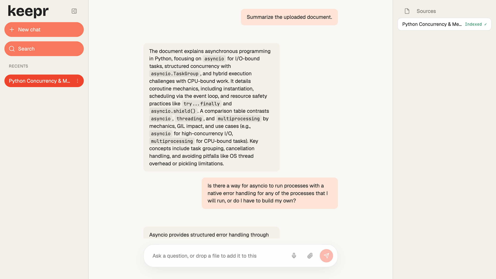

<p align="center">
  
</p>

<p align="center">
  <strong>Un assistant RAG documentaire respectueux de la vie privée et local-first — vos documents, votre machine, vos réponses.</strong>
</p>

<p align="center">
  <a href="../README.md">English</a> •
  <a href="README.es.md">Spanish</a> •
  <a href="README.zh.md">简体中文</a> •
  <a href="README.ru.md">Русский</a> •
  <a href="README.fr.md">Français</a>
</p>

<p align="center">
  <a href="https://github.com/pironc/keepr"></a>
  <a href="https://github.com/pironc/keepr"></a>
  <a href="https://github.com/pironc/keepr"></a>
  <a href="https://github.com/pironc/keepr"></a>
</p>

<p align="center">
  <a href="https://github.com/pironc/keepr/releases/latest/download/keepr-mac-aarch64.dmg"></a>
  <a href="https://github.com/pironc/keepr/releases/latest/download/keepr-mac-x86_64.dmg"></a>
  <a href="https://github.com/pironc/keepr/releases/latest/download/keepr-linux-x86_64.AppImage"></a>
  <a href="https://github.com/pironc/keepr/releases/latest/download/keepr-windows-x86_64-setup.exe"></a>
</p>

# keepr

**keepr** est une application de chat par génération augmentée de récupération (RAG) qui s'exécute entièrement sur votre propre machine. Déposez des PDF ou des fichiers texte, posez des questions et obtenez des réponses fondées sur — et uniquement sur — ce que vous avez téléchargé, avec des citations en ligne qui renvoient au passage source exact. Pas d'API cloud, aucune donnée ne quitte votre appareil, entièrement fonctionnel avec le réseau déconnecté une fois les modèles téléchargés.

<p align="center">
  
</p>

## Table des matières

- [Pourquoi keepr ?](#pourquoi-keepr-)
- [Fonctionnalités](#fonctionnalités)
- [Démarrage](#démarrage)
  - [Docker](#docker)
  - [Développement local](#développement-local)
  - [Variables d'environnement](#variables-denvironnement)
  - [Exécution avec de vrais modèles locaux](#exécution-avec-de-vrais-modèles-locaux)
  - [Application bureau native (macOS)](#application-bureau-native-macos)
- [Développement](#développement)
  - [Structure du projet](#structure-du-projet)
  - [Commandes](#commandes)
  - [Tests](#tests)
  - [Dépannage](#dépannage)
- [Licence](#licence)

Pour la justification technologique de chaque choix, la conception complète du système, le format de communication et la stratégie de mise à l'échelle, consultez **[ARCHITECTURE.md](../ARCHITECTURE.md)** (en anglais).

## Pourquoi keepr ?

La plupart des outils RAG envoient vos documents à une API cloud (risque de confidentialité) ou enveloppent un serveur local opaque comme Ollama (fonctionnement interne obscur). keepr emprunte une troisième voie : **chaque couche est codée à la main, documentée et vous appartient** — des calculs vectoriels jusqu'au streaming des tokens du LLM. La thèse est qu'un système RAG à l'échelle personnelle n'a pas besoin d'infrastructure distribuée ; il a besoin d'un code clair et correct que vous pouvez lire et comprendre de bout en bout.

- **Vos données ne quittent jamais votre machine.** Pas de télémétrie, pas de clés API cloud, pas d'appels réseau pendant l'inférence.
- **Chaque choix technologique a une raison documentée et spécifique** — pas « parce que c'est populaire ». Consultez [ARCHITECTURE.md](../ARCHITECTURE.md) pour la justification complète derrière chaque décision.
- **Le mécanisme anti-hallucination est déterministe** (une comparaison de float par rapport à un seuil de similarité), pas une invite demandant à un modèle 7-8B de s'auto-contrôler.
- **Conçu pour passer à l'échelle** d'un ordinateur portable à un serveur dédié sans réécriture — chaque couche est derrière une interface nommée avec exactement une implémentation concrète aujourd'hui, prête pour une deuxième quand le besoin s'en fera sentir.

## Fonctionnalités

### Vie privée et fonctionnement air-gapped
- `LLM_DRIVER=mock` / `EMBEDDER=mock` (les valeurs par défaut) exécutent l'ensemble du pipeline d'ingestion → récupération → citation sans aucun téléchargement de modèle, testable en millisecondes ; l'inférence réelle passe par `llama-cpp-python` sur des modèles GGUF (Metal, CUDA ou CPU).
- Le frontend est écrit en HTML/CSS/JS vanilla sans aucune dépendance externe — aucun script CDN, aucune étape de build npm, aucune police d'icônes — polices et icônes étant vendues localement en fichiers `.woff2`/`.svg`.
- La suite de tests s'exécute avec `pytest-socket` bloquant tout accès réseau réel, y compris un test de contrôle positif qui échoue si ce blocage est un jour désactivé silencieusement.

### Anti-hallucination déterministe
- La récupération est circonscrite aux documents de cette conversation, jamais à un index global ni aux données de pré-entraînement du modèle.
- Sous un seuil de similarité cosinus, vérifié extrait par extrait (pas seulement sur le meilleur résultat), keepr refuse *avant* que le LLM ne soit jamais appelé (`src/rag/engine.py`) — une comparaison `float`, pas un jugement confié au modèle.
- Après génération, chaque citation `[chunk_N]` est vérifiée par appartenance ensembliste par rapport aux identifiants d'extraits effectivement récupérés pour ce tour, de sorte qu'une citation fabriquée est rejetée plutôt qu'acceptée sur parole.

### Conversations et documents
- Chaque conversation constitue son propre périmètre de récupération — comme un Projet Claude ou un carnet NotebookLM — avec recherche dans la barre latérale, épinglage, et renommage/suppression en ligne via un menu contextuel.
- Les documents sont dédupliqués par hachage de contenu SHA-256 — rattacher à nouveau le même fichier est une opération nulle, pas un doublon d'extraits.

### Tâches de fond durables
- L'ingestion (`IngestionWorker`) et la génération (`GenerationWorker`) s'exécutent chacune sur leur propre file pilotée par la base de données, indépendante de toute connexion HTTP — une vectorisation n'attend jamais qu'une génération LLM sans rapport, seulement une vectorisation précédente. Fermer l'onglet, perdre le réseau ou rafraîchir la page en plein milieu d'une réponse ne met jamais en pause ni ne perd le travail en cours — rouvrir la conversation s'y rattache en direct via SSE.
- Au redémarrage, tout ce qui a été laissé en cours de traitement par un crash précédent est marqué comme erroné avec son contenu partiel préservé, plutôt que de rester bloqué indéfiniment.
- Chaque type de fichier passe par le même protocole `Ingestor` — un statut par fichier (`mis en attente → extraction → segmentation → vectorisation → indexé`) piloté par de vrais événements SSE, pas par un faux minuteur — ce qui rend un futur format (par exemple audio/vidéo, actuellement un `AudioVideoIngestor` — stub propre qui lève `UnsupportedSourceError` plutôt qu'un crash ou un no-op silencieux) ajoutable sans toucher à rien en aval.

### Gestion des modèles intégrée
- Le menu Réglages liste chaque `.gguf` présent dans `models/`, classé comme modèle LLM ou de vectorisation à partir de ses propres métadonnées (une clé de couche de pooling), jamais d'après le nom de fichier.
- Les modèles se téléchargent directement depuis Hugging Face Hub avec une progression en direct ; changer le modèle actif enregistre le choix et redémarre l'application pour que le nouveau modèle se charge réellement — la suppression d'un fichier de modèle fonctionne de la même façon.

### Architecture enfichable
Chaque couche est derrière un protocole/ABC — remplacez les implémentations sans restructurer :

| Couche | Interface | Implémentations |
|---|---|---|
| **Pilote LLM** | `LLMDriver` | `MockLLMDriver` (déterministe, zéro téléchargement), `LlamaCppDriver` (véritable inférence GGUF) |
| **Vectoriseur** | `Embedder` | `MockEmbedder` (sac de mots par astuce de hachage), `LlamaCppEmbedder` (nomic-embed-text-v2-moe, multilingue) |
| **Index vectoriel** | `VectorIndex` | `NumpyFlatIndex` (float32, exact), `QuantizedNumpyFlatIndex` (quantification scalaire int8, ~4× moins de mémoire) |
| **Extracteur** | `Ingestor` | `PdfIngestor`, `TextIngestor`, `AudioVideoIngestor` (stub propre — lève `UnsupportedSourceError`) |
| **Stockage** | `Repository` | SQLite via `aiosqlite` (le seul module qui parle SQL — le passage à Postgres est un changement d'un seul fichier) |

### Application bureau native
- Un wrapper [Tauri](https://tauri.app/) v2 empaquète un backend compilé via PyInstaller dans des installateurs natifs — `.app`/`.dmg` sur macOS, `.exe`/`.msi` sur Windows, `.AppImage`/`.deb` sur Linux — via une matrice de build CI, sans installation Python requise sur la machine cible.
- La même base de code fonctionne comme application web (`make run`, rechargement à chaud) ou comme build bureau native (`make tauri-build`).

---

## Démarrage

### Docker

Le moyen le plus rapide d'obtenir une instance fonctionnelle — aucune configuration Python nécessaire :

**Prérequis :** [Docker](https://docs.docker.com/get-docker/) avec Compose v2.

```bash
git clone https://github.com/pironc/keepr.git
cd keepr
docker compose up --build
```

Ouvrez [http://localhost:8000](http://localhost:8000). Déposez un PDF ou un fichier `.txt` dans le chat et posez une question. Le fichier Compose utilise par défaut `LLM_DRIVER=mock` / `EMBEDDER=mock` — l'ensemble du pipeline s'exécute sans aucun téléchargement de modèle.

Pour une véritable inférence locale, montez vos modèles et changez les pilotes :

```bash
# D'abord, téléchargez les modèles GGUF dans models/ (une seule fois) :
python scripts/download_models.py

# Puis remplacez l'environnement Compose :
LLM_DRIVER=llama_cpp EMBEDDER=llama_cpp docker compose up --build
```

### Développement local

Exécutez nativement avec rechargement à chaud — pas besoin de Docker :

**Prérequis :** Python 3.12+.

```bash
git clone https://github.com/pironc/keepr.git
cd keepr

python3 -m venv .venv && source .venv/bin/activate
make install
make run
```

Ouvrez [http://localhost:8000](http://localhost:8000). Les valeurs par défaut (`LLM_DRIVER=mock`, `EMBEDDER=mock`) ne nécessitent aucun téléchargement — tout le pipeline d'ingestion → récupération → citation est testable immédiatement.

### Variables d'environnement

Copiez `.env.example` vers `.env` pour personnaliser. L'essentiel :

| Variable | Rôle |
|---|---|
| `LLM_DRIVER` | `mock` ou `llama_cpp`. Laissez non défini pour une détection automatique : `llama_cpp` dès qu'un vrai GGUF est présent (téléchargé/sélectionné dans Réglages), `mock` sinon — zéro téléchargement sur une installation neuve, aucune variable nécessaire une fois qu'un modèle existe. |
| `LLM_MODEL_PATH` | Chemin vers le fichier GGUF. Uniquement lorsque `LLM_DRIVER=llama_cpp`. Laissez vide pour utiliser le modèle choisi dans le menu Réglages. |
| `LLM_CONTEXT_WINDOW` | Taille de la fenêtre de contexte (par défaut auto-détectée depuis `MEMORY_TIER`, généralement `8192`). |
| `LLM_GPU_LAYERS` | Couches à déléguer au GPU (`-1` = toutes, par défaut). |
| `EMBEDDER` | `mock` ou `llama_cpp`. Même détection automatique que `LLM_DRIVER`, évaluée indépendamment. |
| `EMBEDDING_MODEL_PATH` | Chemin vers le modèle GGUF de vectorisation. Uniquement lorsque `EMBEDDER=llama_cpp`. Laissez vide pour utiliser le modèle choisi dans le menu Réglages. |
| `EMBEDDING_GPU_LAYERS` | Couches GPU pour la vectorisation (par défaut `0` — la vectorisation s'exécute sur CPU pour éviter la contention GPU avec le LLM). |
| `VECTOR_INDEX_BACKEND` | `flat` (float32, exact) ou `quantized` (quantification scalaire int8, ~4× moins de mémoire). |
| `RETRIEVAL_TOP_K` | Nombre d'extraits à récupérer par requête (par défaut `5`). |
| `RETRIEVAL_MIN_SIMILARITY` | Seuil de similarité cosinus en dessous duquel le moteur refuse de répondre (par défaut `0.22` — calibré sur nomic-embed-text-v2-moe). |
| `MODELS_DIR` | Répertoire où sont cherchés les fichiers de modèle `.gguf` (par défaut `models`). |
| `DATABASE_PATH` | Chemin de la base SQLite (par défaut `data/keepr.db`). |
| `INDEX_DIR` | Répertoire d'index vectoriel par conversation (par défaut `data/index`). |
| `UPLOAD_DIR` | Stockage des fichiers téléchargés (par défaut `data/uploads`). |
| `MEMORY_TIER` | Remplace le budget mémoire auto-détecté (`minimal`, `standard`, `large`, `server`). Laissez non défini pour l'auto-détection. |
| `CHUNK_SIZE` | Caractères par extrait (par défaut `800`). |
| `CHUNK_OVERLAP` | Chevauchement entre extraits consécutifs (par défaut `150`). |
| `LOG_LEVEL` | Niveau de journalisation (par défaut `INFO`). |

### Exécution avec de vrais modèles locaux

Installez le driver `llama_cpp` — un extra séparé, plus lourd (compile `llama-cpp-python` depuis les sources ; sur Apple Silicon, l'accélération Metal est activée automatiquement, sans option supplémentaire) :

```bash
pip install -e ".[llama]"
```

Puis récupérez la paire GGUF Qwen3-8B + nomic-embed-text-v2-moe (~7,5 Go au total) depuis le menu **Réglages** de l'application, ou depuis la CLI :

```bash
python scripts/download_models.py
```

Puis dans `.env` :

```env
LLM_DRIVER=llama_cpp
EMBEDDER=llama_cpp
```

Redémarrez `make run`. Le premier message sera plus lent (chargement du modèle en mémoire) ; tout ce qui suit s'exécute à partir de la pile chaude résidente.

Pour utiliser un autre modèle, placez n'importe quel GGUF compatible llama.cpp dans `models/` et choisissez-le dans le menu **Réglages** — le choix est sauvegardé et appliqué au prochain redémarrage. Vous pouvez aussi définir `LLM_MODEL_PATH` / `EMBEDDING_MODEL_PATH` directement pour le remplacer. (Le modèle de vectorisation est moins librement remplaçable : `RETRIEVAL_MIN_SIMILARITY` est calibré sur nomic-embed-text-v2-moe, donc le changer implique de recalibrer ce seuil.)

### Application bureau native (macOS)

```bash
# Mode développement — ouvre une fenêtre native pointant vers http://localhost:8000.
# Le backend Python doit déjà être en cours d'exécution (`make run` dans un autre terminal).
make tauri-dev

# Build de production — compile le backend Python en un binaire autonome,
# l'empaquète dans un .app, et produit un installateur .dmg.
make tauri-build
```

Le `.app` compilé ne nécessite aucune installation Python sur la machine cible — le backend est un binaire PyInstaller autonome intégré dans le bundle.

---

## Développement

### Structure du projet

```
keepr/
├── src/
│   ├── models.py              # Modèles Pydantic v2 — source unique de vérité
│   ├── config.py              # Détection matérielle, paliers mémoire, paramètres
│   ├── concurrency.py         # Wrappers LockedEmbedder / LockedLLMDriver
│   ├── logger.py              # Journalisation structurée
│   ├── download.py            # Aides au téléchargement de modèles (Hugging Face Hub, partagées avec la CLI)
│   ├── gguf_meta.py           # Classifieur léger de métadonnées GGUF (détection du pooling)
│   ├── model_unavailable.py   # ModelUnavailableError — fichier GGUF manquant/cassé, par rôle
│   ├── api/
│   │   ├── app.py             # Fabrique d'application FastAPI + cycle de vie
│   │   ├── context.py         # AppContext + injection de dépendances
│   │   ├── routes_conversations.py
│   │   ├── routes_messages.py # Point de terminaison SSE multiplexé
│   │   ├── routes_models.py   # Points de terminaison statut/sélection/téléchargement de modèles
│   │   └── sse.py             # Utilitaires de formatage SSE
│   ├── db/
│   │   ├── pool.py            # SQLiteConnectionPool
│   │   ├── repository.py      # Le SEUL module qui parle SQL
│   │   └── schema.py          # Instructions CREATE TABLE
│   ├── embeddings/
│   │   ├── base.py            # Protocole Embedder
│   │   ├── mock_embedder.py   # Vectoriseur déterministe par astuce de hachage
│   │   ├── llama_cpp_embedder.py  # Véritable vectorisation GGUF
│   │   └── factory.py
│   ├── ingestion/
│   │   ├── base.py            # Protocole Ingestor
│   │   ├── pipeline.py        # Orchestre extraire→segmenter→vectoriser→indexer
│   │   ├── worker.py          # Tâche de fond — durable, indépendante de la connexion
│   │   ├── chunker.py         # Segmentation de texte avec chevauchement
│   │   ├── registry.py        # Trouve le bon extracteur pour un fichier
│   │   ├── pdf_ingestor.py
│   │   ├── text_ingestor.py
│   │   └── audio_video_ingestor.py  # Stub propre — lève UnsupportedSourceError
│   ├── llm/
│   │   ├── base.py            # ABC LLMDriver (flux de tokens asynchrone)
│   │   ├── mock_driver.py     # Pilote mock déterministe pour les tests
│   │   ├── llama_cpp_driver.py    # Véritable inférence GGUF avec suppression du thinking
│   │   └── factory.py
│   ├── rag/
│   │   ├── engine.py          # Cœur RAG : récupération + seuil + génération + vérification des citations
│   │   ├── prompts.py         # Invite système d'ancrage
│   │   ├── generation_worker.py   # Tâche de fond — durable, indépendante de la connexion
│   │   ├── index_manager.py   # Cache d'index vectoriel par conversation
│   │   ├── greeting.py        # Détection rapide des salutations/formules de politesse
│   │   └── title.py           # Titres de conversation générés par LLM
│   ├── vectorstore/
│   │   ├── base.py            # Protocole VectorIndex
│   │   ├── flat_index.py      # NumpyFlatIndex (float32, exact)
│   │   ├── quantized_flat_index.py  # Quantification scalaire int8
│   │   ├── similarity.py      # Normalisation L2
│   │   └── factory.py
│   └── web/                   # HTML/CSS/JS vanilla — zéro dépendance externe
│       ├── templates/index.html
│       └── static/
│           ├── app.js
│           ├── app.css
│           └── fonts/         # Fichiers .woff2 vendus localement (pas de CDN Google Fonts)
├── src-tauri/                 # Wrapper bureau natif Tauri v2 (Rust)
│   ├── Cargo.toml
│   ├── tauri.conf.json
│   ├── src/lib.rs
│   └── binaries/              # Binaire backend compilé par PyInstaller
├── tests/                     # pytest + pytest-asyncio + pytest-socket
├── models/                    # Poids de modèles .gguf téléchargés (MODELS_DIR)
├── scripts/
│   └── download_models.py     # Récupérateur unique de modèles GGUF (script réseau exempté de tests)
├── assets/                    # Logo, captures d'écran
│   └── icons/                 # Icônes de marque blanches pour les boutons de téléchargement
├── ARCHITECTURE.md            # Conception technique complète et stratégie de mise à l'échelle
├── CLAUDE.md                  # Guide pour l'assistant IA / contributeurs
├── Makefile
├── Dockerfile
├── docker-compose.yml
└── pyproject.toml
```

### Commandes

```bash
make install          # pip install -e ".[dev]"
make run              # uvicorn src.api.app:app --reload --port 8000
make test             # pytest
make lint             # ruff check .
make typecheck        # mypy --strict
make ci               # lint + typecheck + test — à exécuter avant de considérer quoi que ce soit comme terminé
make clean            # efface DB/index/fichiers téléchargés (état de l'application) — PAS les poids des modèles
make clean-models     # efface aussi models/
make wipe             # réinitialisation complète vers un état tout juste cloné (venv, caches,
                       # sortie de build, src-tauri/target, etc.) — models/ toujours exempté
```

### Tests

```bash
make ci   # ruff check . && mypy && pytest
```

La suite de tests s'exécute avec l'accès réseau désactivé globalement (`pytest-socket`) — tout test qui ouvre une vraie socket réseau fait échouer toute la suite. Les pilotes mock et les vectoriseurs mock rendent les tests rapides et déterministes (aucun téléchargement de modèle, aucun appel API instable). `asyncio_mode = "auto"` signifie que `async def test_...` fonctionne directement.

Fichiers de test clés :
- `tests/test_rag_engine.py` — refus basé sur le seuil, vérification des citations (y compris un pilote qui fabrique délibérément une citation)
- `tests/test_generation_worker.py` — génération indépendante de la connexion, récupération après crash, rattachement de l'observateur
- `tests/test_ingestion_worker.py` — ingestion indépendante de la connexion, récupération après crash, minutage du déchargement en cas d'inactivité
- `tests/test_ingestion_pipeline.py` — déduplication par hachage de contenu, transitions de statut
- `tests/test_vectorstore.py` — ratio mémoire de quantification et benchmarks d'accord du top-1
- `tests/test_airgapped.py` — contrôle positif prouvant que le blocage des sockets est actif
- `tests/test_llama_cpp_driver.py` — suppression du thinking à travers des tags fractionnés, sans besoin de modèle

### Dépannage

**Les réponses semblent sans rapport avec mes documents**

La similarité de récupération est peut-être en dessous du seuil — vérifiez les logs du serveur pour le score de similarité cosinus réel et comparez-le à `RETRIEVAL_MIN_SIMILARITY`. Si vous utilisez un vectoriseur différent de nomic-embed-text-v2-moe, recalibrez le seuil (voir `ARCHITECTURE.md`).

**Le pilote mock donne des réponses génériques**

Le pilote mock analyse les tags `[chunk_N]` de l'invite système pour des réponses déterministes. Si aucun extrait n'a été récupéré (index vide), il refusera. Ajoutez d'abord un document.

**`make run` échoue avec une erreur d'importation**

Exécutez d'abord `make install` — le paquet doit être installé en mode éditable.

---

## Licence

keepr est distribué sous la [licence MIT](../LICENSE).

Généré avec [Claude Code](https://claude.com/claude-code)
