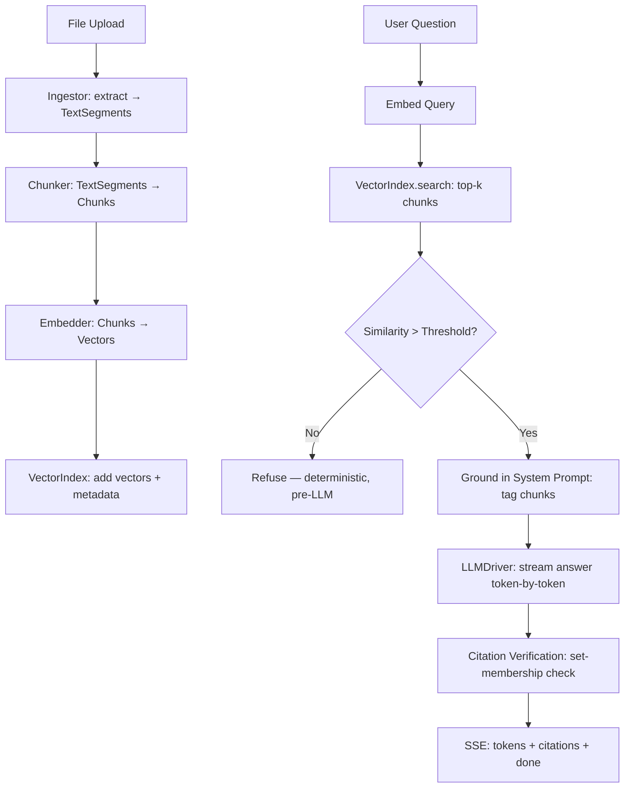

<p align="center">
  
</p>

<p align="center">
  <strong>Конфиденциальный, локальный RAG-ассистент для документов — ваши документы, ваше устройство, ваши ответы.</strong>
</p>

<p align="center">
  <a href="../README.md">English</a> •
  <a href="README.es.md">Spanish</a> •
  <a href="README.zh.md">简体中文</a> •
  <a href="README.ru.md">Русский</a> •
  <a href="README.fr.md">Français</a>
</p>

<p align="center">
  <a href="https://github.com/pironc/keepr"></a>
  <a href="https://github.com/pironc/keepr"></a>
  <a href="https://github.com/pironc/keepr"></a>
</p>

# keepr

**keepr** — это чат-приложение с дополненной поисковой генерацией (RAG), которое полностью работает на вашем собственном устройстве. Загрузите PDF или текстовые файлы, задавайте вопросы и получайте ответы, основанные исключительно на том, что вы загрузили, с инлайн-цитатами, указывающими на точный исходный фрагмент. Никаких облачных API, никакие данные не покидают ваше устройство, полностью работоспособно при отключённой сети после загрузки моделей.

<p align="center">
  
</p>

## Почему keepr?

Большинство RAG-инструментов либо отправляют ваши документы в облачный API (риск для конфиденциальности), либо оборачивают непрозрачный локальный сервер, такой как Ollama (непрозрачные внутренности). keepr выбирает третий путь: **каждый слой написан вручную, задокументирован и принадлежит вам** — от математики векторного индекса до потоковой передачи токенов LLM. Идея в том, что RAG-система персонального масштаба не нуждается в распределённой инфраструктуре; ей нужен ясный, корректный код, который вы можете прочитать и понять от начала до конца.

- **Ваши данные никогда не покидают ваше устройство.** Никакой телеметрии, никаких ключей облачных API, никаких сетевых вызовов во время инференса.
- **Каждый технологический выбор имеет задокументированную, конкретную причину** — а не «потому что это популярно». См. [ARCHITECTURE.md](../ARCHITECTURE.md) с полным обоснованием каждого решения.
- **Механизм защиты от галлюцинаций детерминирован** (сравнение float с порогом схожести), а не промпт, требующий от модели на 7-8B самоконтроля.
- **Спроектирован для масштабирования** от ноутбука до выделенного сервера без переписывания — каждый слой находится за именованным интерфейсом, с ровно одной конкретной реализацией на сегодня, готовой ко второй, когда потребуется.

## Возможности

### 🔒 Конфиденциальность и автономная работа
- **Полностью локально по умолчанию.** `LLM_DRIVER=mock` / `EMBEDDER=mock` (значения по умолчанию) запускают весь конвейер ingestion → retrieval → citation без загрузки моделей — проверяется за миллисекунды.
- **Настоящие локальные модели** через `llama-cpp-python` (формат GGUF) на Metal (Apple Silicon), CUDA или CPU.
- **Автономность по дизайну.** Фронтенд написан вручную на чистом HTML/CSS/JS без внешних зависимостей — никаких CDN-скриптов, никакого npm-этапа сборки. Шрифты поставляются локально как файлы `.woff2`; иконки — вручную созданные инлайн SVG.
- **Доказанная автономность.** Весь набор тестов выполняется с `pytest-socket`, блокирующим весь реальный сетевой доступ, включая позитивный контрольный тест, доказывающий, что блокировка действительно активна.

### 📄 Обоснованный RAG с детерминированной защитой от галлюцинаций
- Каждый ответ подкреплён фрагментами, извлечёнными из документов *в этом разговоре* — не из глобального индекса, не из предобученных данных модели.
- **Отказ до вызова LLM:** Если косинусная схожесть ни одного извлечённого фрагмента не превышает порог, keepr отказывается *до* того, как LLM вообще будет вызвана — детерминированное сравнение `float`, а не оценочное суждение, переданное модели.
- **Постгенерационная верификация цитат:** После того как LLM выдает ответ потоком, каждый тег цитирования `[chunk_N]` проверяется на принадлежность множеству ID фрагментов, действительно извлечённых в этом запросе. Модель не может сфабриковать цитату на документ, которого перед ней никогда не было — это обеспечивается проверкой принадлежности множеству, а не доверием к выводу модели.
- **Индивидуальная пороговая проверка на фрагмент:** Каждый извлечённый фрагмент проверяется на соответствие порогу схожести индивидуально, а не только лучший — один сильный результат не может затянуть в контекст несколько едва связанных фрагментов.

### 🗂️ Область поиска в пределах разговора
- Каждый разговор имеет свою собственную область поиска, подобно проекту Claude или блокноту NotebookLM.
- Боковая панель позволяет переключаться между разговорами, искать по заголовку, закреплять избранные, а также переименовывать или удалять через контекстное меню по правому клику.
- Документы дедуплицируются по хешу содержимого (SHA-256) — повторное прикрепление того же файла ничего не делает, а не молча дублирует каждый фрагмент.

### ⚡ Живой конвейер обработки
- Файл подготавливается при перетаскивании и обрабатывается в момент отправки: **извлечение → разбивка на фрагменты → эмбеддинг → индексация**.
- Покадровая анимация статуса файла (`staged → extracting → chunking → embedding → indexed`) управляется реальными SSE-событиями с бэкенда, а не поддельным таймером.
- Каждый тип файла проходит через один и тот же конвейер — протокол `Ingestor` позволяет в будущем добавить поддержку аудио/видео, не затрагивая ничего downstream.

### 🔄 Надёжная генерация, независимая от соединения
- В момент отправки генерация сообщения запускается как **фоновая задача**, независимая от вашего HTTP-соединения.
- Обновите страницу в середине ответа — ответ продолжает генерироваться и в любом случае попадает в базу данных. Перезагрузка переподключается к нему в реальном времени, на какой бы стадии он ни находился.
- Восстановление после сбоя: при запуске любое сообщение, застрявшее в середине генерации из-за предыдущего аварийного завершения процесса, помечается как ошибочное с сохранением частичного содержимого, а не остаётся висеть бесконечно.

### 🧱 Модульная архитектура
Каждый слой находится за протоколом/ABC — заменяйте реализации без перестройки структуры:

| Слой | Интерфейс | Реализации |
|---|---|---|
| **LLM-драйвер** | `LLMDriver` | `MockLLMDriver` (детерминированный, без загрузок), `LlamaCppDriver` (реальный GGUF-инференс) |
| **Эмбеддер** | `Embedder` | `MockEmbedder` (мешок слов с хеш-трюком), `LlamaCppEmbedder` (nomic-embed-text-v2-moe, мультиязычный) |
| **Векторный индекс** | `VectorIndex` | `NumpyFlatIndex` (float32, точный), `QuantizedNumpyFlatIndex` (int8 скалярное квантование, ~4× меньше памяти) |
| **Обработчик (Ingestor)** | `Ingestor` | `PdfIngestor`, `TextIngestor`, `AudioVideoIngestor` (чистая заглушка — вызывает `UnsupportedSourceError`) |
| **Хранилище** | `Repository` | SQLite через `aiosqlite` (единственный модуль, говорящий на SQL — переход на Postgres это изменение в одном файле) |

### 🖥️ Нативное десктопное приложение
- Обёртка [Tauri](https://tauri.app/) v2 упаковывает Python-бэкенд (скомпилированный через PyInstaller) в нативный macOS-бандл `.app` и установщик `.dmg`.
- На целевой машине не требуется установка Python — бэкенд представляет собой автономный бинарный файл, встроенный в приложение.
- Одна и та же кодовая база работает как веб-приложение (`make run` для разработки с горячей перезагрузкой) или как нативное десктопное приложение (`make tauri-build` для распространения).

---

## Технологический стек и обоснование

Каждый выбор в этом стеке был сделан по конкретной, задокументированной причине — а не по соглашению или популярности. См. [ARCHITECTURE.md](../ARCHITECTURE.md) для полного обоснования; вот краткое изложение:

| Слой | Выбор | Почему это, а не альтернатива |
|---|---|---|
| **Язык** | Python 3.12+ | Достаточно быстр для однопользовательского приложения; ML-экосистема (numpy, llama-cpp-python) нативна для Python. |
| **API-фреймворк** | FastAPI + uvicorn | Нативная поддержка async, встроенная потоковая передача SSE, строгая система типов через Pydantic v2. |
| **LLM-инференс** | `llama-cpp-python` (GGUF) | Ollama быстрее доходит до демо, но непрозрачна внутри. `llama-cpp-python` даёт реальный доступ к внутренностям GGUF/K-quant/mmap из одной кодовой базы на Metal, CUDA и CPU — вы можете прочитать, как именно работает инференс. |
| **LLM-модель** | Qwen3-8B, Q6_K (~6.7 GB) | Перешли с Llama 3.1 8B ради мультиязычной поддержки — Qwen значительно опережает в бенчмарках на китайском языке и в мультиязычном MMLU (~80 против ~72). Q6_K, а не более лёгкое квантование, потому что бюджет памяти это позволяет. Более новые MoE-варианты (Qwen3.5/3.6) были сознательно не выбраны: на машинах с unified memory (Apple Silicon) неактивные MoE-эксперты всё равно занимают реальную RAM — 8B плотная модель лучше подходит для этого оборудования. |
| **Эмбеддинг-модель** | `nomic-embed-text-v2-moe` (GGUF, Q8_0) | Мультиязычная (~100 языков, 8-экспертный MoE), 768 измерений. Тот же путь GGUF, то же соглашение о префиксах `search_document:`/`search_query:`, что и v1.5 — замена «вставь и работай» вместо англоязычной v1.5. |
| **Векторное хранилище** | Самодельный `NumpyFlatIndex` (float32, точный) | При корпусе персонального масштаба (тысячи фрагментов) полный перебор косинусной схожести — это *не* компромисс, а технически правильный выбор: точный (без потерь ANN- recall), доли миллисекунды, и каждая строка математики объяснима. |
| **Векторное квантование** | Самодельное int8 скалярное квантование | Повекторное min/max масштабирование в int8 — ~4× сокращение памяти, 100% совпадение top-1 с float32 на отложенных запросах. Реализовано с нуля, потому что смысл во владении техникой, а не в настройке чужого флага. |
| **Парсинг PDF** | `pypdf` | Чистый Python, без тяжёлых нативных зависимостей, разрешительная лицензия (избегает условий AGPL PyMuPDF). |
| **Хранилище** | SQLite через `aiosqlite` | Правильный выбор для одного локального пользователя. Класс `Repository` — единственный модуль, говорящий на SQL — переход на Postgres ограничен одним файлом. |
| **Фронтенд** | Чистый HTML/CSS/JS, ноль зависимостей | Загрузка htmx или Alpine с CDN молча нарушила бы заявление об автономности при первой загрузке страницы. Вендоринг добавляет стороннюю зависимость для отслеживания. ~250 строк простого JS было более честным компромиссом. |
| **Десктопная оболочка** | Tauri v2 (Rust) | Лёгкая (~5 MB накладных расходов бинарника против 100+ MB для Electron). Python-бэкенд компилируется в автономный бинарник через PyInstaller и упаковывается внутрь `.app`. |
| **Менеджер пакетов** | pip + hatchling | Стандартный инструментарий Python. Зависимости минимальны и закреплены свободно (`>=`), не зафиксированы — подходит для приложения, а не библиотеки. |
| **Линтинг и проверка типов** | ruff + mypy (`--strict`) | Быстрый, современный инструментарий Python. Вся кодовая база строго типизирована — `make typecheck` должен проходить. |
| **Тестирование** | pytest + pytest-asyncio + pytest-socket | `asyncio_mode = "auto"`, так что `async def test_...` просто работает. `--disable-socket` глобально блокирует сетевой доступ в тестах — позитивный контрольный тест доказывает, что блокировка активна. |

---

## Системная архитектура

Приложение изолирует обработку документов в отдельные, несвязанные этапы — каждый за именованным интерфейсом:



### 1. Конвейер обработки
Каждый файл, независимо от типа, проходит через один унифицированный конвейер: **извлечение → разбивка на фрагменты → эмбеддинг → индексация**. Каждая реализация `Ingestor` преобразует свой исходный формат в `TextSegment` (текст + `PageRef` или `TimeRef`); разбивка на фрагменты, эмбеддинг, индексация и цитирование на 100% унифицированы downstream от этого. Это единственное дизайнерское решение, которое делает аудио/видео расширяемым в будущем — реализация настоящей транскрипции означает заполнение одного метода `extract()`, и ничего больше.

### 2. Защита от галлюцинаций детерминирована
Системный промпт (`src/rag/prompts.py`) действительно просит модель отказываться и ссылаться на источники — но это *вторая* линия защиты. Первая — это сравнение `float` в `src/rag/engine.py`: если косинусная схожесть ни одного извлечённого фрагмента не превышает `RETRIEVAL_MIN_SIMILARITY`, движок возвращает текст отказа, **даже не создавая промпт и не вызывая LLM**. Верификация цитат — та же философия, применённая downstream: после генерации каждый тег `[chunk_N]` в выводе проверяется на принадлежность множеству ID фрагментов, извлечённых *для этого конкретного запроса*.

### 3. Область поиска в пределах разговора
Документы ограничены разговором, в который они были помещены — а не объединены в один глобальный индекс. Каждый разговор получает свой собственный `VectorIndex`, сохранённый в `data/index/{conversation_id}.npz` и кешированный в памяти после первого использования. Это позволяет избежать путаницы «почему оно процитировало что-то из несвязанного чата», которую породил бы единый глобальный индекс.

---

## Структуры данных

### Отправка сообщения (`POST /api/conversations/{id}/messages`)
Мultipart-форма с текстом вопроса пользователя и любыми новыми подготовленными файлами. Бэкенд передаёт потоком единственный SSE-ответ, несущий как прогресс обработки, так и ответ:

```
event: document_status
data: {"document_id":"d1","filename":"report.pdf","status":"extracting"}

event: document_status
data: {"document_id":"d1","filename":"report.pdf","status":"indexed"}

event: message_status
data: {"status":"retrieving"}

event: token
data: {"token":"The"}

event: token
data: {"token":" report"}

event: citations
data: {"citations":[{"chunk_id":"c3","document_id":"d1","document_filename":"report.pdf","source_ref":{"kind":"page","page":4},"snippet":"Revenue grew 12% YoY..."}]}

event: done
data: {}
```

### Поток переподключения (`GET /api/conversations/{id}/messages/{message_id}/stream`)
Маршрут, который вызывает обновлённая страница для переподключения к активной (или уже завершённой) генерации. Возвращает тот же поток SSE-событий, воспроизводя завершённые токены, а затем переходя в реальный режим.

### Основные модели
Каждая общая структура находится в `src/models.py` как Pydantic v2 модель — единый источник истины как для передачи данных, так и для базы данных:

```python
class SourceRef(PageRef | TimeRef):  # discriminated on `kind`
    """Деталь, которая делает цитаты расширяемыми до аудио/видео в будущем.
    Добавление реального обработчика аудио/видео приводит лишь к новому варианту
    TimeRef — это никогда не требует изменения Chunk, Citation или чего-либо
    downstream."""

class Chunk(BaseModel):
    id: str
    document_id: str
    conversation_id: str
    text: str
    source_ref: SourceRef
    chunk_index: int

class Citation(BaseModel):
    chunk_id: str
    document_id: str
    document_filename: str
    source_ref: SourceRef
    snippet: str

class Message(BaseModel):
    id: str
    conversation_id: str
    role: Literal["system", "user", "assistant"]
    content: str
    citations: list[Citation]
    status: MessageStatus  # queued → retrieving → generating → done | error
    created_at: datetime
```

---

## Начало работы

Полное руководство по архитектуре и масштабированию: **[ARCHITECTURE.md](../ARCHITECTURE.md)**.

### Docker

Самый быстрый способ получить работающий экземпляр — без настройки Python:

**Требования:** [Docker](https://docs.docker.com/get-docker/) с Compose v2.

```bash
git clone https://github.com/pironc/keepr.git
cd keepr
docker compose up --build
```

Откройте [http://localhost:8000](http://localhost:8000). Перетащите PDF или `.txt` файл в чат и задайте вопрос. Compose-файл по умолчанию использует `LLM_DRIVER=mock` / `EMBEDDER=mock` — весь конвейер работает без загрузки моделей.

Для реального локального инференса подключите ваши модели и переключите драйверы:

```bash
# Сначала загрузите GGUF-модели в data/models/ (однократно):
make download-models

# Затем переопределите переменные окружения Compose:
LLM_DRIVER=llama_cpp EMBEDDER=llama_cpp docker compose up --build
```

### Локальная разработка

Запуск нативно с горячей перезагрузкой — Docker не требуется:

**Требования:** Python 3.12+.

```bash
git clone https://github.com/pironc/keepr.git
cd keepr

python3 -m venv .venv && source .venv/bin/activate
make install
make run
```

Откройте [http://localhost:8000](http://localhost:8000). Значения по умолчанию (`LLM_DRIVER=mock`, `EMBEDDER=mock`) не требуют загрузок — весь конвейер ingestion → retrieval → citation можно протестировать немедленно.

### Переменные окружения

Скопируйте `.env.example` в `.env` для настройки. Основные переменные:

| Переменная | Назначение |
|---|---|
| `LLM_DRIVER` | `mock` (по умолчанию, без загрузок) или `llama_cpp` (реальный локальный GGUF-инференс). |
| `LLM_MODEL_PATH` | Путь к GGUF-файлу. Только при `LLM_DRIVER=llama_cpp`. |
| `LLM_CONTEXT_WINDOW` | Размер контекстного окна (по умолчанию автоопределяется из `MEMORY_TIER`, обычно `8192`). |
| `LLM_GPU_LAYERS` | Слои для выгрузки на GPU (`-1` = все, по умолчанию). |
| `EMBEDDER` | `mock` (по умолчанию) или `llama_cpp`. |
| `EMBEDDING_MODEL_PATH` | Путь к GGUF-модели эмбеддинга. Только при `EMBEDDER=llama_cpp`. |
| `EMBEDDING_GPU_LAYERS` | Слои эмбеддинга на GPU (по умолчанию `0` — эмбеддинг работает на CPU во избежание конкуренции за GPU с LLM). |
| `VECTOR_INDEX_BACKEND` | `flat` (float32, точный) или `quantized` (int8 скалярное квантование, ~4× меньше памяти). |
| `RETRIEVAL_TOP_K` | Количество извлекаемых фрагментов на запрос (по умолчанию `5`). |
| `RETRIEVAL_MIN_SIMILARITY` | Порог косинусной схожести, ниже которого движок отказывается отвечать (по умолчанию `0.22` — откалиброван под nomic-embed-text-v2-moe). |
| `DATABASE_PATH` | Путь к базе данных SQLite (по умолчанию `data/keepr.db`). |
| `INDEX_DIR` | Директория векторных индексов для каждого разговора (по умолчанию `data/index`). |
| `UPLOAD_DIR` | Хранилище загруженных файлов (по умолчанию `data/uploads`). |
| `MEMORY_TIER` | Переопределить автоопределяемый бюджет памяти (`minimal`, `standard`, `large`, `server`). Оставьте незаданным для автоопределения. |
| `CHUNK_SIZE` | Символов на фрагмент (по умолчанию `800`). |
| `CHUNK_OVERLAP` | Перекрытие между последовательными фрагментами (по умолчанию `150`). |
| `LOG_LEVEL` | Уровень логирования (по умолчанию `INFO`). |

### Запуск с реальными локальными моделями

```bash
make download-models   # загружает пару GGUF Qwen3-8B + nomic-embed-text-v2-moe (~7.5 GB всего)
```

Затем в `.env`:

```env
LLM_DRIVER=llama_cpp
EMBEDDER=llama_cpp
```

Перезапустите `make run`. Первое сообщение будет медленнее (загрузка модели в память); всё последующее работает из резидентного прогретого стека.

### Нативное десктопное приложение (macOS)

```bash
# Режим разработки — открывает нативное окно, указывающее на http://localhost:8000.
# Python-бэкенд уже должен быть запущен (`make run` в другом терминале).
make tauri-dev

# Продакшн-сборка — компилирует Python-бэкенд в автономный бинарник,
# упаковывает его в .app и создаёт установщик .dmg.
make tauri-build
```

Скомпилированный `.app` не требует установки Python на целевой машине — бэкенд представляет собой автономный PyInstaller-бинарник, встроенный в бандл.

---

## Разработка

### Структура проекта

```
keepr/
├── src/
│   ├── models.py              # Pydantic v2 модели — единый источник истины
│   ├── config.py              # Определение оборудования, уровни памяти, Settings
│   ├── concurrency.py         # Обёртки LockedEmbedder / LockedLLMDriver
│   ├── logger.py              # Структурированное логирование
│   ├── api/
│   │   ├── app.py             # Фабрика приложения FastAPI + lifespan
│   │   ├── context.py         # AppContext + DI
│   │   ├── routes_conversations.py
│   │   ├── routes_messages.py # Мультиплексированная SSE-точка
│   │   └── sse.py             # Вспомогательные функции форматирования SSE
│   ├── db/
│   │   ├── pool.py            # SQLiteConnectionPool
│   │   ├── repository.py      # ЕДИНСТВЕННЫЙ модуль, говорящий на SQL
│   │   └── schema.py          # Операторы CREATE TABLE
│   ├── embeddings/
│   │   ├── base.py            # Протокол Embedder
│   │   ├── mock_embedder.py   # Детерминированный эмбеддер с хеш-трюком
│   │   ├── llama_cpp_embedder.py  # Реальный GGUF-эмбеддинг
│   │   └── factory.py
│   ├── ingestion/
│   │   ├── base.py            # Протокол Ingestor
│   │   ├── pipeline.py        # Оркестрирует extract→chunk→embed→index
│   │   ├── chunker.py         # Разбивка текста на фрагменты с перекрытием
│   │   ├── registry.py        # Находит правильный обработчик для файла
│   │   ├── pdf_ingestor.py
│   │   ├── text_ingestor.py
│   │   └── audio_video_ingestor.py  # Чистая заглушка — вызывает UnsupportedSourceError
│   ├── llm/
│   │   ├── base.py            # ABC LLMDriver (асинхронный поток токенов)
│   │   ├── mock_driver.py     # Детерминированный мок для тестов
│   │   ├── llama_cpp_driver.py    # Реальный GGUF-инференс с отсечением размышлений
│   │   └── factory.py
│   ├── rag/
│   │   ├── engine.py          # Ядро RAG: поиск + порог + генерация + верификация цитат
│   │   ├── prompts.py         # Системный промпт заземления
│   │   ├── generation_worker.py   # Фоновая задача — надёжная, независимая от соединения
│   │   ├── index_manager.py   # Кеш векторных индексов для каждого разговора
│   │   ├── greeting.py        # Быстрое определение приветствий/прощаний
│   │   └── title.py           # Сгенерированные LLM заголовки разговоров
│   ├── vectorstore/
│   │   ├── base.py            # Протокол VectorIndex
│   │   ├── flat_index.py      # NumpyFlatIndex (float32, точный)
│   │   ├── quantized_flat_index.py  # int8 скалярное квантование
│   │   ├── similarity.py      # L2-нормализация
│   │   └── factory.py
│   └── web/                   # Чистый HTML/CSS/JS — ноль внешних зависимостей
│       ├── templates/index.html
│       └── static/
│           ├── app.js
│           ├── app.css
│           └── fonts/         # Вендоренные .woff2 файлы (без Google Fonts CDN)
├── src-tauri/                 # Нативная десктопная обёртка Tauri v2 (Rust)
│   ├── Cargo.toml
│   ├── tauri.conf.json
│   ├── src/lib.rs
│   └── binaries/              # PyInstaller-скомпилированный бэкенд-бинарник
├── tests/                     # pytest + pytest-asyncio + pytest-socket
├── scripts/
│   └── download_models.py     # Однократный загрузчик GGUF-моделей (единственный скрипт, касающийся сети)
├── assets/                    # Логотип, скриншоты
├── ARCHITECTURE.md            # Полное техническое проектирование и история масштабирования
├── CLAUDE.md                  # Руководство для AI-ассистента / контрибьюторов
├── Makefile
├── Dockerfile
├── docker-compose.yml
└── pyproject.toml
```

### Команды

```bash
make install          # pip install -e ".[dev]"
make run              # uvicorn src.api.app:app --reload --port 8000
make download-models  # загрузить GGUF-модели (единственный шаг, касающийся сети)
make test             # pytest
make lint             # ruff check .
make typecheck        # mypy --strict
make ci               # lint + typecheck + test — выполнить перед тем, как считать что-либо готовым
make clean            # очищает DB/index/uploads (состояние приложения) — НЕ веса моделей
make clean-models     # очищает также data/models/
```

### Тестирование

```bash
make ci   # ruff check . && mypy && pytest
```

Набор тестов выполняется с глобально отключённым сетевым доступом (`pytest-socket`) — любой тест, открывающий реальный сетевой сокет, проваливает весь набор. Мок-драйверы и эмбеддеры делают тесты быстрыми и детерминированными (без загрузки моделей, без нестабильных API-вызовов). `asyncio_mode = "auto"` означает, что `async def test_...` просто работает.

Ключевые тестовые файлы:
- `tests/test_rag_engine.py` — пороговый отказ, верификация цитат (включая драйвер, намеренно фабрикующий цитату)
- `tests/test_generation_worker.py` — генерация, независимая от соединения, восстановление после сбоя, переподключение наблюдателя
- `tests/test_ingestion_pipeline.py` — дедупликация по хешу содержимого, переходы статусов
- `tests/test_vectorstore.py` — коэффициент сжатия памяти квантования и бенчмарки совпадения top-1
- `tests/test_airgapped.py` — позитивный контроль, доказывающий, что блокировка сокетов активна
- `tests/test_llama_cpp_driver.py` — отсечение размышлений при разделённых тегах, модель не требуется

### Устранение неполадок

**Ответы кажутся не связанными с моими документами**

Схожесть при поиске может быть ниже порога — проверьте логи сервера на фактический балл косинусной схожести и сравните с `RETRIEVAL_MIN_SIMILARITY`. Если вы используете другой эмбеддер, отличный от nomic-embed-text-v2-moe, перекалибруйте порог (см. `ARCHITECTURE.md`).

**Мок-драйвер даёт обобщённые ответы**

Мок-драйвер разбирает теги `[chunk_N]` из системного промпта для детерминированных ответов. Если фрагменты не были извлечены (пустой индекс), он откажется отвечать. Сначала добавьте документ.

**`make run` завершается с ошибкой импорта**

Сначала выполните `make install` — пакет должен быть установлен в редактируемом режиме.

---

## Масштабирование за пределы ноутбука

Каждый выбор был сделан для одного локального пользователя на одной машине — но ни один из них не является тупиком. Вот что изменится, если система переедет на выделенную машину:

| Аспект | На ноутбуке (сегодня) | На выделенной машине | Что меняется |
|---|---|---|---|
| **Размер модели** | Qwen3-8B, Q6_K, контекст 8k–16k | Класс 32B+/70B, контекст 32k+ | Только переменные окружения — лестница уровней `config.py` уже имеет уровень `server` |
| **Векторный поиск** | Самодельный плоский NumPy, точный | ANN-индекс (Qdrant, LanceDB) при 500K+ векторов | Ещё одна реализация `VectorIndex` — тот же интерфейс |
| **Хранилище** | SQLite, один файл, один пользователь | Postgres, конкурентные пользователи | `repository.py` — единственный модуль, говорящий на SQL |
| **Обработка (Ingestion)** | Встроенная на каждый запрос | Фоновая очередь задач (Celery/arq) | Изменение диспетчеризации — логика конвейера неизменна |
| **Аудио/видео** | Чистая заглушка | Настоящая транскрипция (faster-whisper) | Реализовать `extract()` — всё downstream готово |

Лейтмотив: каждый из этих пунктов — это **именованный интерфейс с ровно одной конкретной реализацией на сегодня**. Масштабирование означает добавление второй реализации за интерфейсом, который уже существует, а не перестройку системы под новые требования.

---

## Что сознательно ещё не реализовано

Чётко обозначаем границы:

- **Настоящая транскрипция аудио/видео.** `AudioVideoIngestor.extract()` сегодня вызывает `UnsupportedSourceError`. План: `faster-whisper`, ленивая загрузка, очистка памяти после использования.
- **Усечение/суммаризация истории разговора.** Длинные разговоры в настоящее время отправляют полную историю модели при каждом запросе.
- **BM25/поиск по ключевым словам, объединённый с векторным поиском** (Reciprocal Rank Fusion) — дёшево добавить, отлавливает запросы с точными терминами, которые эмбеддинги пропускают.
- **Устойчивость обработки файлов к разрыву соединения.** Обработка выполняется встроенно в запросе; обновление страницы в середине загрузки оставляет документ с застрявшим статусом (хотя уже сохранённые фрагменты выживают). Та же модель, что `GenerationWorker` использовал для сообщений, обобщается напрямую.
- **Размеченный оценочный набор для заземления** (30-50 вопросов по категориям: отвечаемые/неотвечаемые/состязательные, с принудительным CI) — механизм протестирован; более широкая статистическая обвязка — естественный следующий шаг.

---

## Принципы проектирования

1. **Владейте своим стеком.** Каждая строка конвейера поиска/индексации/инференса находится в этом репозитории — никаких черных ящиков, никаких «просто настройте этот флаг».
2. **Детерминизм вместо промптов для гарантий безопасности.** Главное заявление «не галлюцинирует» опирается на сравнение float и проверку принадлежности множеству, а не на доверие к суждению модели.
3. **Интерфейсы прежде реализаций.** Каждая граница слоя — это протокол/ABC. Добавление нового бэкенда означает реализацию интерфейса, который уже существует.
4. **Персональный масштаб — это не компромисс, а правильная точка проектирования.** Полный перебор точного поиска, однопроцессная конкурентность и SQLite — это правильные выборы в данном масштабе, а не уступки.
5. **Автономность доказана, а не заявлена.** Набор тестов блокирует весь сетевой доступ — любой путь кода, открывающий сокет, проваливает весь набор.

---

## Лицензия

keepr распространяется под лицензией [MIT License](LICENSE).

🤖 Сгенерировано с помощью [Claude Code](https://claude.com/claude-code)
