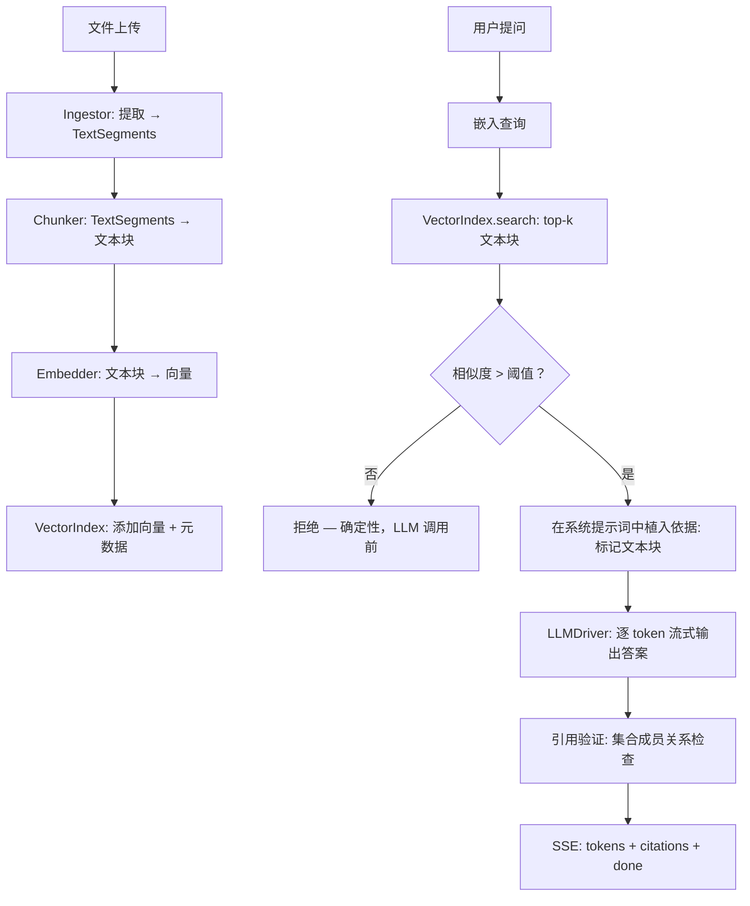

<p align="center">
  
</p>

<p align="center">
  <strong>一个隐私优先、本地优先的文档 RAG 助手——你的文档、你的设备、你的答案。</strong>
</p>

<p align="center">
  <a href="../README.md">English</a> •
  <a href="README.es.md">Spanish</a> •
  <a href="README.zh.md">简体中文</a> •
  <a href="README.ru.md">Русский</a> •
  <a href="README.fr.md">Français</a>
</p>

<p align="center">
  <a href="https://github.com/pironc/keepr"></a>
  <a href="https://github.com/pironc/keepr"></a>
  <a href="https://github.com/pironc/keepr"></a>
  <a href="https://github.com/pironc/keepr"></a>
</p>

<p align="center"><em>Downloads</em></p>
<p align="center">
  <a href="https://github.com/pironc/keepr/releases/latest/download/keepr-mac-aarch64.dmg" style="display:inline-flex; align-items:center; gap:6px; background-color:#FF6600; color:#ffffff; padding:5px 14px; border-radius:999px; font-weight:600; text-decoration:none; font-size:12px; margin:2px 3px;">OSX&#160;ARM</a>
  <a href="https://github.com/pironc/keepr/releases/latest/download/keepr-mac-x86_64.dmg" style="display:inline-flex; align-items:center; gap:6px; background-color:#FF6600; color:#ffffff; padding:5px 14px; border-radius:999px; font-weight:600; text-decoration:none; font-size:12px; margin:2px 3px;">OSX&#160;x86</a>
  <a href="https://github.com/pironc/keepr/releases/latest/download/keepr-linux-x86_64.AppImage" title="Linux" style="display:inline-block; background-color:#FF6600; border-radius:999px; padding:5px; margin:2px 3px; line-height:0;"></a>
  <a href="https://github.com/pironc/keepr/releases/latest/download/keepr-windows-x86_64-setup.exe" title="Windows" style="display:inline-block; background-color:#FF6600; border-radius:999px; padding:5px; margin:2px 3px; line-height:0;"></a>
</p>

# keepr

**keepr** 是一个完全在你自己的设备上运行的检索增强生成（RAG）聊天应用。拖入 PDF 或文本文件，提出问题，获取基于——且仅基于——你上传内容的答案，并附带指向确切原文段落的内联引用。无需云 API，数据不会离开你的设备，模型下载完成后即可在完全断网状态下正常工作。

<p align="center">
  
</p>

## 为什么选择 keepr？

大多数 RAG 工具要么将你的文档发送到云 API（隐私风险），要么封装一个黑盒本地服务器如 Ollama（内部不透明）。keepr 走了第三条路：**每一层都是手写、有文档记录、由你完全拥有**——从向量索引数学到 LLM 分词流。核心理念是：个人规模的 RAG 系统不需要分布式基础设施；它需要的是清晰、正确、你可以端到端阅读和理解的代码。

- **你的数据永远不会离开你的设备。** 无遥测，无云 API 密钥，推理期间无网络调用。
- **每个技术选择都有文档记录的、具体的理由**——不是"因为它流行"。完整决策理由见 [ARCHITECTURE.md](../ARCHITECTURE.md)。
- **反幻觉机制是确定性的**（针对相似度阈值的浮点数比较），而不是让一个 7-8B 模型自我审查的提示词。
- **设计为从笔记本扩展到专用服务器而无需重写**——每一层都位于命名接口之后，目前各有一个具体实现，需要时随时可添加第二个。

## 功能特性

### 🔒 隐私与离线运行
- **默认完全本地。** `LLM_DRIVER=mock` / `EMBEDDER=mock`（默认值）在零模型下载的情况下运行完整的摄入→检索→引用管线——可在毫秒内完成测试。
- **真实的本地模型**通过 `llama-cpp-python`（GGUF 格式）在 Metal（Apple Silicon）、CUDA 或 CPU 上运行。
- **设计上即支持离线。** 前端是手写原生 HTML/CSS/JS，零外部依赖——无 CDN script 标签，无 npm 构建步骤。字体以本地 `.woff2` 文件形式内置；图标为手写/本地内置为 `.svg` 文件（无图标 CDN）。
- **离线能力已验证。** 整个测试套件在 `pytest-socket` 阻止所有真实网络访问的情况下运行，包含一个正向控制测试来证明该阻止确实生效。

### 📄 基于聊天的 RAG 与确定性反幻觉
- 每个答案都由该对话中文档检索到的文本块支撑——不是全局索引，不是模型的预训练数据。
- **LLM 调用前拒绝：** 如果没有检索到文本块的余弦相似度超过阈值，keepr 会在调用 LLM *之前*就拒绝——这是一个确定性的 `float` 比较，而不是交给模型的主观判断。
- **生成后引用验证：** LLM 流式输出答案后，每个 `[chunk_N]` 引用标签都会与该轮实际检索到的文本块 ID 集合进行比对。模型无法伪造一个从未出现在它面前的文档引用——这是通过集合成员关系强制执行的，而不是靠信任模型的输出。
- **逐块独立阈值判定：** 每个检索到的文本块都单独与相似度门槛比较，而不仅仅取最佳结果——避免一个强匹配将几个勉强相关的文本块拖入上下文。

### 🗂️ 按对话的检索范围
- 每个对话拥有独立的检索范围，如同 Claude Project 或 NotebookLM 笔记本。
- 侧边栏允许你在对话之间切换、按标题搜索、置顶收藏，以及通过右键上下文菜单进行内联重命名或删除。
- 文档通过内容哈希（SHA-256）去重——重复添加同一文件是无操作，不会静默地使每个文本块翻倍。

### ⚡ 实时摄入管线
- 文件在拖入时暂存，在你按下发送的瞬间开始处理：**提取→分块→嵌入→索引**。
- 每个文件的状态动画（`等待中→提取中→分块中→嵌入中→已索引`）由真实后端 SSE 事件驱动，而非虚假的定时器。
- 每种文件类型都经过同一条管线——`Ingestor` 协议使得日后支持音频/视频时无需修改下游任何代码。
- 作为独立的后台任务（`IngestionWorker`）运行，独立于你的 HTTP 连接——关闭标签页或在上传过程中断网都不会暂停或丢失正在进行的提取→分块→嵌入→索引工作；重新打开该对话会实时重新连接到它。

### 🔄 持久化、独立于连接的生成
- 从你按下发送的那一刻起，消息生成就作为**后台任务**（`GenerationWorker`）运行，独立于你的 HTTP 连接，拥有与摄入任务分离的独立队列——嵌入操作只会等待前一个嵌入操作，绝不会等待无关的 LLM 生成。
- 在回答生成过程中刷新页面——回答会继续生成并最终写入数据库。重新加载后可以实时重新连接到它，无论它进行到了哪一步。
- 崩溃恢复：启动时，任何因上次进程异常终止而卡在处理中途的消息或文档都会被标记为错误状态，并保留其已生成的部分内容，而不是永远空转等待。

### ⚙️ 内置模型管理
- 设置菜单会列出 `models/` 中的每个 `.gguf` 文件，仅根据其自身元数据（一个池化层标记）而非文件名，将其分类为 LLM 模型或嵌入模型——无需维护一份硬编码的模型名称列表来应对不断出现的新架构。
- 直接从设置中下载模型（Hugging Face Hub，带实时进度），无需先运行单独的命令行步骤。
- 切换当前使用的 LLM 或嵌入模型会保存该选择并重启应用，以便新模型真正被加载；删除模型文件也以同样的方式提供。

### 🧱 可插拔架构
每一层都位于协议/ABC 之后——无需重构即可替换实现：

| 层 | 接口 | 实现 |
|---|---|---|
| **LLM 驱动** | `LLMDriver` | `MockLLMDriver`（确定性，零下载），`LlamaCppDriver`（真实 GGUF 推理） |
| **嵌入器** | `Embedder` | `MockEmbedder`（哈希技巧词袋），`LlamaCppEmbedder`（nomic-embed-text-v2-moe，多语言） |
| **向量索引** | `VectorIndex` | `NumpyFlatIndex`（float32，精确），`QuantizedNumpyFlatIndex`（int8 标量量化，约 4 倍内存节省） |
| **摄入器** | `Ingestor` | `PdfIngestor`、`TextIngestor`、`AudioVideoIngestor`（干净的占位桩——抛出 `UnsupportedSourceError`） |
| **存储** | `Repository` | 通过 `aiosqlite` 的 SQLite（唯一使用 SQL 的模块——切换到 Postgres 只需修改一个文件） |

### 🖥️ 原生桌面应用
- 一个 [Tauri](https://tauri.app/) v2 封装器将 Python 后端（通过 PyInstaller 编译）打包为原生 macOS `.app` 包和 `.dmg` 安装程序。
- 目标机器上无需安装 Python——后端是嵌入在应用内的独立可执行文件。
- 同一代码库既可以作为 Web 应用运行（`make run` 用于开发时的热重载），也可以作为原生桌面应用运行（`make tauri-build` 用于分发）。

---

## 技术栈与选型理由

这个技术栈中的每一个选择都有具体的、有文档记录的理由——而非出于惯例或流行度。完整推理见 [ARCHITECTURE.md](../ARCHITECTURE.md)；以下是摘要：

| 层 | 选择 | 为何选它，而不是替代方案 |
|---|---|---|
| **语言** | Python 3.12+ | 对单用户应用来说足够快；ML 生态（numpy、llama-cpp-python）是 Python 原生的。 |
| **API 框架** | FastAPI + uvicorn | 原生异步，内置 SSE 流，通过 Pydantic v2 提供强类型系统。 |
| **LLM 推理** | `llama-cpp-python`（GGUF） | Ollama 做出演示更快，但内部不透明。`llama-cpp-python` 在一个代码库中提供了真实的 GGUF/K-quant/mmap 内部机制，跨 Metal、CUDA 和 CPU——你可以准确了解推理是如何运行的。 |
| **LLM 模型** | Qwen3-8B, Q6_K（约 6.7 GB） | 从 Llama 3.1 8B 更换为多语言支持——Qwen 在中文基准测试中以大幅优势领先，多语言 MMLU（约 80 vs. 约 72）。选择 Q6_K 而非更小量化级别是因为内存预算还有余量。刻意未选择更新的 MoE 变体（Qwen3.5/3.6）：在统一内存机器（Apple Silicon）上，未被激活的 MoE 专家仍然占用实际内存——8B 稠密模型更适合这种硬件。 |
| **嵌入模型** | `nomic-embed-text-v2-moe`（GGUF, Q8_0） | 多语言（约 100 种语言，8 专家 MoE），768 维。使用相同的 GGUF 路径，相同的 `search_document:`/`search_query:` 前缀惯例——可直接从仅支持英文的 v1.5 替换。 |
| **向量存储** | 手写 `NumpyFlatIndex`（float32，精确） | 在个人规模语料（数千个文本块）下，暴力余弦相似度*不是*走捷径——它在技术上是正确的选择：精确（无 ANN 召回损失），亚毫秒级，且数学运算的每一行都是可解释的。 |
| **向量量化** | 手写 int8 标量量化 | 逐向量 min/max 缩放到 int8——约 4 倍内存节省，在留出查询上达到 100% top-1 与 float32 一致。从零实现，因为关键是有权拥有这项技术，而不是配置别人的开关。 |
| **PDF 解析** | `pypdf` | 纯 Python，无重型原生依赖，宽松许可证（避免 PyMuPDF 的 AGPL 条款）。 |
| **存储** | 通过 `aiosqlite` 的 SQLite | 对单个本地用户是正确选择。`Repository` 类是唯一使用 SQL 的模块——切换到 Postgres 只需修改一个文件。 |
| **前端** | 原生 HTML/CSS/JS，零依赖 | 从 CDN 加载 htmx 或 Alpine 会在首次页面加载时悄无声息地打破离线声明。内置这些库会增加需追踪的第三方依赖。约 250 行纯 JS 是更诚实的权衡。 |
| **桌面壳** | Tauri v2（Rust） | 轻量（约 5 MB 二进制开销，对比 Electron 的 100+ MB）。Python 后端通过 PyInstaller 编译为独立可执行文件并打包在 `.app` 中。 |
| **包管理器** | pip + hatchling | 标准 Python 工具。依赖最小化，版本约束宽松（`.>=`），不做锁定——适用于应用而非库。 |
| **代码检查与类型检查** | ruff + mypy（`--strict`） | 快速、现代的 Python 工具。整个代码库严格类型化——`make typecheck` 必须通过。 |
| **测试** | pytest + pytest-asyncio + pytest-socket | `asyncio_mode = "auto"`，所以 `async def test_...` 直接可用。`--disable-socket` 全局阻止测试中的网络访问——正向控制测试证明该阻止确实生效。 |

---

## 系统架构

该应用将文档处理隔离为相互独立、解耦的阶段——每个阶段都位于命名接口之后：



### 1. 摄入管线
每个文件，无论类型，都经过一条统一的管线：**提取→分块→嵌入→索引**。每个 `Ingestor` 实现将其源格式化简为 `TextSegment`（文本 + `PageRef` 或 `TimeRef`）；分块、嵌入、索引和引用在下游 100% 统一。正是这一设计决策使得日后支持音频/视频成为可能——实现真实的转录只需填充一个 `extract()` 方法，别无他物。

### 2. 反幻觉是确定性的
系统提示词（`src/rag/prompts.py`）确实要求模型拒绝回答并引用来源——但那是*第二道*防线。第一道是 `src/rag/engine.py` 中的一个 `float` 比较：如果没有检索到文本块的余弦相似度超过 `RETRIEVAL_MIN_SIMILARITY`，引擎会返回拒绝文本，**而不会构建提示词或调用 LLM**。引用验证是同样的哲学在下游的应用：生成后，输出中的每个 `[chunk_N]` 标签都会与*该特定轮次*检索到的文本块 ID 集合进行比对。

### 3. 按对话的检索范围
文档的范围限定在它们被拖入的那个对话内——不会汇入一个全局索引。每个对话拥有自己的 `VectorIndex`，持久化到 `data/index/{conversation_id}.npz`，首次使用后缓存在内存中。这避免了单个全局索引会产生的"为什么它引用了来自不相关聊天的内容"的困惑。

---

## 数据结构

### 消息提交 (`POST /api/conversations/{id}/messages`)
一个包含用户问题文本和任何新暂存文件的 multipart 表单。后端流式返回单个 SSE 响应，同时承载摄入进度和答案：

```
event: document_status
data: {"document_id":"d1","filename":"report.pdf","status":"extracting"}

event: document_status
data: {"document_id":"d1","filename":"report.pdf","status":"indexed"}

event: message_status
data: {"status":"retrieving"}

event: token
data: {"token":"The"}

event: token
data: {"token":" report"}

event: citations
data: {"citations":[{"chunk_id":"c3","document_id":"d1","document_filename":"report.pdf","source_ref":{"kind":"page","page":4},"snippet":"Revenue grew 12% YoY..."}]}

event: done
data: {}
```

### 重新连接流 (`GET /api/conversations/{id}/messages/{message_id}/stream`)
刷新后的页面调用此路由以重新连接到进行中（或已完成）的生成。返回相同的 SSE 事件流，重放已完成的 token，然后进入实时传输。

### 核心模型
每个共享数据结构都定义在 `src/models.py` 中，作为 Pydantic v2 模型——网络传输和数据库的单一真相来源：

```python
class SourceRef(PageRef | TimeRef):  # 按 `kind` 区分
    """这个细节使得日后引用可以扩展到音频/视频。
    添加真正的音频/视频摄入器只会产生一个新的 TimeRef 变体——
    永远不需要修改 Chunk、Citation 或任何下游内容。"""

class Chunk(BaseModel):
    id: str
    document_id: str
    conversation_id: str
    text: str
    source_ref: SourceRef
    chunk_index: int

class Citation(BaseModel):
    chunk_id: str
    document_id: str
    document_filename: str
    source_ref: SourceRef
    snippet: str

class Message(BaseModel):
    id: str
    conversation_id: str
    role: Literal["system", "user", "assistant"]
    content: str
    citations: list[Citation]
    status: MessageStatus  # 排队中 → 处理文档中 → 检索中 → 生成中 → 完成 | 错误
    created_at: datetime
```

---

## 快速开始

完整架构和扩展指南：**[ARCHITECTURE.md](../ARCHITECTURE.md)**。

### Docker

获取运行实例的最快方式——无需配置 Python 环境：

**前置条件：** [Docker](https://docs.docker.com/get-docker/) 及 Compose v2。

```bash
git clone https://github.com/pironc/keepr.git
cd keepr
docker compose up --build
```

打开 [http://localhost:8000](http://localhost:8000)。将 PDF 或 `.txt` 文件拖入聊天并提问。Compose 文件默认使用 `LLM_DRIVER=mock` / `EMBEDDER=mock`——整个管线在零模型下载的情况下运行。

如需真实的本地推理，挂载你的模型并切换驱动：

```bash
# 首先，下载 GGUF 模型到 models/（一次性操作）：
python scripts/download_models.py

# 然后覆盖 Compose 环境变量：
LLM_DRIVER=llama_cpp EMBEDDER=llama_cpp docker compose up --build
```

### 本地开发

原生运行并支持热重载——无需 Docker：

**前置条件：** Python 3.12+。

```bash
git clone https://github.com/pironc/keepr.git
cd keepr

python3 -m venv .venv && source .venv/bin/activate
make install
make run
```

打开 [http://localhost:8000](http://localhost:8000)。默认值（`LLM_DRIVER=mock`、`EMBEDDER=mock`）无需任何下载——整个摄入→检索→引用管线立即可测试。

### 环境变量

将 `.env.example` 复制为 `.env` 来自定义配置。关键变量：

| 变量 | 用途 |
|---|---|
| `LLM_DRIVER` | `mock`（默认，零下载）或 `llama_cpp`（真实本地 GGUF 推理）。 |
| `LLM_MODEL_PATH` | GGUF 文件路径。仅当 `LLM_DRIVER=llama_cpp` 时使用。留空则使用“设置”菜单中选定的模型。 |
| `LLM_CONTEXT_WINDOW` | 上下文窗口大小（默认根据 `MEMORY_TIER` 自动检测，通常为 `8192`）。 |
| `LLM_GPU_LAYERS` | 卸载到 GPU 的层数（`-1` = 全部，默认）。 |
| `EMBEDDER` | `mock`（默认）或 `llama_cpp`。 |
| `EMBEDDING_MODEL_PATH` | GGUF 嵌入模型路径。仅当 `EMBEDDER=llama_cpp` 时使用。留空则使用“设置”菜单中选定的模型。 |
| `EMBEDDING_GPU_LAYERS` | 嵌入 GPU 层数（默认 `0`——嵌入在 CPU 上运行，以避免与 LLM 争抢 GPU）。 |
| `VECTOR_INDEX_BACKEND` | `flat`（float32，精确）或 `quantized`（int8 标量量化，约 4 倍内存节省）。 |
| `RETRIEVAL_TOP_K` | 每次查询检索的文本块数量（默认 `5`）。 |
| `RETRIEVAL_MIN_SIMILARITY` | 余弦相似度阈值，低于此值引擎拒绝回答（默认 `0.22`——针对 nomic-embed-text-v2-moe 校准）。 |
| `MODELS_DIR` | 扫描 `.gguf` 模型文件的目录（默认 `models`）。 |
| `DATABASE_PATH` | SQLite 数据库路径（默认 `data/keepr.db`）。 |
| `INDEX_DIR` | 按对话的向量索引目录（默认 `data/index`）。 |
| `UPLOAD_DIR` | 上传文件存储目录（默认 `data/uploads`）。 |
| `MEMORY_TIER` | 覆盖自动检测的内存预算（`minimal`、`standard`、`large`、`server`）。不设置则以自动检测为准。 |
| `CHUNK_SIZE` | 每个文本块的字符数（默认 `800`）。 |
| `CHUNK_OVERLAP` | 相邻文本块之间的重叠字符数（默认 `150`）。 |
| `LOG_LEVEL` | 日志级别（默认 `INFO`）。 |

### 使用真实本地模型运行

安装 `llama_cpp` 驱动——一个单独的、更重的可选依赖（从源码编译 `llama-cpp-python`；在 Apple Silicon 上会自动启用 Metal 加速，无需额外参数）：

```bash
pip install -e ".[llama]"
```

然后可以从应用的**设置**菜单获取 Qwen3-8B + nomic-embed-text-v2-moe GGUF 模型对（总计约 7.5 GB），也可以通过命令行：

```bash
python scripts/download_models.py
```

然后在 `.env` 中：

```env
LLM_DRIVER=llama_cpp
EMBEDDER=llama_cpp
```

重启 `make run`。第一条消息会较慢（模型加载到内存中）；之后的一切都在驻留的热堆栈上运行。

如果想使用不同的模型，将任何 llama.cpp 兼容的 GGUF 文件放入 `models/`，然后在**设置**菜单中选它——选择会被保存并在下次重启时生效。你也可以直接设置 `LLM_MODEL_PATH` / `EMBEDDING_MODEL_PATH` 来覆盖它。（嵌入模型不能随意更换：`RETRIEVAL_MIN_SIMILARITY` 是针对 nomic-embed-text-v2-moe 校准的，更换意味着需要重新校准该阈值。）

### 原生桌面应用（macOS）

```bash
# 开发模式——打开一个指向 http://localhost:8000 的原生窗口。
# Python 后端必须已在运行（在另一个终端中执行 `make run`）。
make tauri-dev

# 生产构建——将 Python 后端编译为独立可执行文件，
# 打包进 .app，并生成 .dmg 安装程序。
make tauri-build
```

编译后的 `.app` 在目标机器上无需安装 Python——后端是嵌入在包内的自包含 PyInstaller 可执行文件。

---

## 开发

### 项目结构

```
keepr/
├── src/
│   ├── models.py              # Pydantic v2 模型——单一真相来源
│   ├── config.py              # 硬件检测、内存层级、设置
│   ├── concurrency.py         # LockedEmbedder / LockedLLMDriver 封装器
│   ├── logger.py              # 结构化日志
│   ├── download.py            # 模型下载辅助（Hugging Face Hub，与 CLI 共用）
│   ├── gguf_meta.py           # 轻量级 GGUF 元数据分类器（pooling 检测）
│   ├── model_unavailable.py   # ModelUnavailableError —— 按角色区分的缺失/损坏 GGUF 文件
│   ├── api/
│   │   ├── app.py             # FastAPI 应用工厂 + 生命周期
│   │   ├── context.py         # AppContext + 依赖注入
│   │   ├── routes_conversations.py
│   │   ├── routes_messages.py # 多路复用 SSE 端点
│   │   ├── routes_models.py   # 模型状态/选择/下载端点
│   │   └── sse.py             # SSE 格式化辅助函数
│   ├── db/
│   │   ├── pool.py            # SQLiteConnectionPool
│   │   ├── repository.py      # 唯一使用 SQL 的模块
│   │   └── schema.py          # CREATE TABLE 语句
│   ├── embeddings/
│   │   ├── base.py            # Embedder 协议
│   │   ├── mock_embedder.py   # 确定性哈希技巧嵌入器
│   │   ├── llama_cpp_embedder.py  # 真实 GGUF 嵌入
│   │   └── factory.py
│   ├── ingestion/
│   │   ├── base.py            # Ingestor 协议
│   │   ├── pipeline.py        # 编排 提取→分块→嵌入→索引
│   │   ├── worker.py          # 后台任务——持久化、独立于连接
│   │   ├── chunker.py         # 带重叠的文本分块
│   │   ├── registry.py        # 为文件找到合适的摄入器
│   │   ├── pdf_ingestor.py
│   │   ├── text_ingestor.py
│   │   └── audio_video_ingestor.py  # 干净的占位桩——抛出 UnsupportedSourceError
│   ├── llm/
│   │   ├── base.py            # LLMDriver ABC（异步 token 流）
│   │   ├── mock_driver.py     # 用于测试的确定性模拟驱动
│   │   ├── llama_cpp_driver.py    # 真实 GGUF 推理，带思考内容剥离
│   │   └── factory.py
│   ├── rag/
│   │   ├── engine.py          # 核心 RAG：检索 + 阈值 + 生成 + 引用验证
│   │   ├── prompts.py         # 基于依据的系统提示词
│   │   ├── generation_worker.py   # 后台任务——持久化，独立于连接
│   │   ├── index_manager.py   # 按对话的向量索引缓存
│   │   ├── greeting.py        # 快速路径问候/告别检测
│   │   └── title.py           # LLM 生成对话标题
│   ├── vectorstore/
│   │   ├── base.py            # VectorIndex 协议
│   │   ├── flat_index.py      # NumpyFlatIndex（float32，精确）
│   │   ├── quantized_flat_index.py  # int8 标量量化
│   │   ├── similarity.py      # L2 归一化
│   │   └── factory.py
│   └── web/                   # 原生 HTML/CSS/JS——零外部依赖
│       ├── templates/index.html
│       └── static/
│           ├── app.js
│           ├── app.css
│           └── fonts/         # 内置 .woff2 文件（无 Google Fonts CDN）
├── src-tauri/                 # Tauri v2 原生桌面封装器（Rust）
│   ├── Cargo.toml
│   ├── tauri.conf.json
│   ├── src/lib.rs
│   └── binaries/              # PyInstaller 编译的后端可执行文件
├── tests/                     # pytest + pytest-asyncio + pytest-socket
├── models/                    # 已下载的 .gguf 模型权重（MODELS_DIR）
├── scripts/
│   └── download_models.py     # 一次性 GGUF 模型下载器（免测试的网络脚本）
├── assets/                    # Logo、截图
│   └── icons/                 # 下载按钮使用的白色品牌图标
├── ARCHITECTURE.md            # 完整技术设计与扩展方案
├── CLAUDE.md                  # AI 助手 / 贡献者指南
├── Makefile
├── Dockerfile
├── docker-compose.yml
└── pyproject.toml
```

### 命令

```bash
make install          # pip install -e ".[dev]"
make run              # uvicorn src.api.app:app --reload --port 8000
make test             # pytest
make lint             # ruff check .
make typecheck        # mypy --strict
make ci               # lint + typecheck + test——在认为完成之前应运行此命令
make clean            # 清除数据库/索引/上传文件（应用状态）——不包括模型权重
make clean-models     # 同时清除 models/
make wipe             # 完全重置到刚克隆时的状态（venv、缓存、
                       # 构建产物、src-tauri/target 等）——models/ 仍然保留不动
```

### 测试

```bash
make ci   # ruff check . && mypy && pytest
```

测试套件在全局禁用网络访问（`pytest-socket`）的情况下运行——任何打开真实网络套接字的测试都会导致整个套件失败。模拟驱动和嵌入器使测试快速且具有确定性（无需模型下载，无不可靠的 API 调用）。`asyncio_mode = "auto"` 意味着 `async def test_...` 直接可用。

关键测试文件：
- `tests/test_rag_engine.py`——基于阈值的拒绝、引用验证（包括一个刻意伪造引用的驱动）
- `tests/test_generation_worker.py`——独立于连接的生成、崩溃恢复、观察者重新连接
- `tests/test_ingestion_worker.py`——独立于连接的文档摄入、崩溃恢复、空闲卸载的时序
- `tests/test_ingestion_pipeline.py`——内容哈希去重、状态转换
- `tests/test_vectorstore.py`——量化内存比率及 top-1 一致性基准
- `tests/test_airgapped.py`——正向控制，证明套接字阻止确实生效
- `tests/test_llama_cpp_driver.py`——跨分割标签的思考内容剥离，无需真实模型

### 故障排除

**答案似乎与我的文档无关**

检索相似度可能低于阈值——检查服务器日志中的实际余弦相似度分数，并与 `RETRIEVAL_MIN_SIMILARITY` 对比。如果你使用的嵌入器不是 nomic-embed-text-v2-moe，请重新校准阈值（参见 `ARCHITECTURE.md`）。

**模拟驱动给出通用回复**

模拟驱动从系统提示词中解析 `[chunk_N]` 标签以生成确定性响应。如果没有检索到文本块（空索引），它会拒绝回答。请先添加文档。

**`make run` 因导入错误失败**

先运行 `make install`——该包需要以可编辑模式安装。

---

## 从笔记本向外扩展

每个选择都是为单个本地用户在一台机器上而做的——但没有一个是死胡同。以下是如果迁移到专用机器上需要改变的内容：

| 关注点 | 笔记本上（当前） | 专用机器上 | 需要改变什么 |
|---|---|---|---|
| **模型大小** | Qwen3-8B, Q6_K, 8k–16k 上下文 | 32B+/70B 级别, 32k+ 上下文 | 仅环境变量——`config.py` 的层级阶梯已有 `server` 层级 |
| **向量搜索** | 手写扁平 NumPy，精确 | 50 万+ 向量时的 ANN 索引（Qdrant、LanceDB） | 再多一个 `VectorIndex` 实现——相同的接口 |
| **存储** | SQLite，一个文件，一个用户 | Postgres，并发用户 | 只有 `repository.py` 使用 SQL |
| **摄入** | 请求内联处理 | 后台任务队列（Celery/arq） | 调度方式改变——管线逻辑不变 |
| **音频/视频** | 干净的占位桩 | 真实转录（faster-whisper） | 实现 `extract()`——下游一切已就绪 |

贯穿始终的主线：以上每一项都是一个**命名接口，目前各有一个具体实现**。扩展意味着在已存在的接口后面添加第二个实现，而不是围绕新需求重构整个系统。

---

## 刻意尚未构建的部分

明确范围：

- **真实的音频/视频转录。** `AudioVideoIngestor.extract()` 目前抛出 `UnsupportedSourceError`。计划：`faster-whisper`，延迟加载，使用后释放内存。
- **对话历史截断/摘要。** 长对话目前每轮都将完整历史发送给模型。
- **BM25/关键词搜索与向量搜索融合**（倒数秩融合）——添加成本低，可以捕捉嵌入遗漏的精确术语查询。
- **一个标注的依据评估集**（30-50 个问题，涵盖可回答/不可回答/对抗性类别，CI 强制执行）——机制已经过测试；更广泛的统计框架是自然的下一步。

---

## 设计原则

1. **拥有你的技术栈。** 检索/索引/推理管线的每一行代码都在这个仓库中——没有黑盒服务，没有"只需配置这个开关"。
2. **用确定性的方式而非提示词来保证安全性。** 头号"不会幻觉"声明的核心是一个浮点数比较和一个集合成员关系检查，而不是信任模型的判断。
3. **接口先于实现。** 每个层级边界都是协议/ABC。添加新的后端意味着实现一个已经存在的接口。
4. **个人规模不是走捷径——它是正确的设计定位。** 暴力精确搜索、单进程并发和 SQLite 在这个规模下是正确的选择，而非妥协。
5. **离线能力是被证明的，而非口头声明。** 测试套件阻止所有网络访问——任何打开套接字的代码路径都会导致整个套件失败。

---

## 许可证

keepr 基于 [MIT 许可证](LICENSE) 授权。

🤖 由 [Claude Code](https://claude.com/claude-code) 生成
